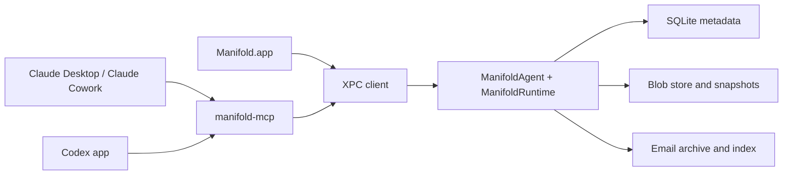
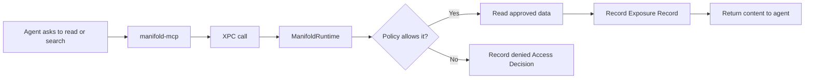
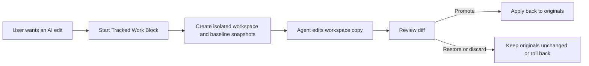

# Manifold Architecture

Manifold is a local runtime and app surface for one core job: giving Claude and Codex controlled access to the files and emails the user chooses, while recording what was exposed and keeping reviewable edits in tracked workspaces.

This document explains the technical shape behind that product model.

## Product Model First

The architecture follows the product spec, not the other way around.

- **Per-Agent Access Policy**: Claude and Codex can have different file and email visibility.
- **Standing Access**: read and search through Manifold.
- **Tracked Work Block**: reviewable edits inside an isolated workspace.
- **History Layer**: Access Decisions, Exposure Records, Version History, and Session Context.

The key rule is simple:

- `Standing Access` is for read/search.
- `Tracked Work Blocks` are for writes.

## Coverage Model

The runtime should make coverage explicit instead of implying more control than it has.

- **Manifold-Routed**: reads and searches that go through Manifold can be governed and recorded.
- **Tracked Workspace**: edits inside a tracked workspace can be snapshotted, reviewed, restored, promoted, or discarded.
- **Outside Coverage**: native activity outside the Manifold path is not fully governed by Manifold and should be surfaced honestly when detected.

Drift detection belongs in this model as a visibility layer, not as a claim of total enforcement.

## System Shape



The runtime is the source of truth. The app is a client of that runtime. The MCP server is also a client of that runtime.

## Main Components

### Manifold.app

The native SwiftUI app is the user-facing control surface.

It is responsible for:

- showing current file and email visibility
- showing activity, history, and coverage state
- starting and reviewing Tracked Work Blocks
- surfacing approvals, restores, drift, and version history

It is not the source of truth for policy or audit data.

### ManifoldAgent

`ManifoldAgent` is a bundled LaunchAgent helper that keeps the runtime available even when the main window is closed.

It is responsible for:

- hosting the XPC listener
- keeping the runtime alive
- owning the long-lived local service boundary

### ManifoldRuntime

`ManifoldRuntime` is the core of the system.

It is responsible for:

- policy decisions
- audit and exposure recording
- workspace lifecycle
- snapshot and restore operations
- history and session context queries

This is the real judge in the system.

### manifold-mcp

`manifold-mcp` is the V1 agent adapter.

It is responsible for:

- exposing Manifold tools to Claude Desktop/Cowork and Codex through MCP
- forwarding requests into the runtime over XPC
- staying thin rather than duplicating policy or storage logic

MCP is the first adapter, not the whole architecture.

## Trust Boundary

Manifold governs the path that goes through Manifold.

That means:

- if an agent reads or searches through `manifold-mcp`, the runtime can allow or deny it and record the outcome
- if an agent edits through a Tracked Work Block, the runtime can snapshot, review, restore, promote, or discard the changes

That does not mean:

- Manifold fully controls every native Claude or Codex capability
- Manifold fully controls computer use, vendor-hosted connectors, or arbitrary direct filesystem access outside its path

The architecture should always present that boundary honestly.

## Local Identity

The runtime should trust verified local caller identity, not only a declared agent label.

The intended direction is:

- bind callers to their XPC connection
- apply code-signing requirements where supported by macOS XPC
- avoid treating `"Claude"` or `"Codex"` as sufficient proof of identity by itself

This is especially important because the product promise depends on the runtime being a real trust boundary, not just a cooperative protocol surface.

## Data and History

The runtime persists four kinds of product data:

- **Policy data**: what Claude and Codex are allowed to see
- **Exposure data**: what content was actually returned through Manifold
- **Workspace and snapshot data**: tracked edits, baselines, restores, promotions
- **Session context**: nearby files, emails, and audit events that explain what a change was part of

At the storage level, that maps roughly to:

- SQLite for metadata, policy, audit records, and indexes
- content-addressed blobs for tracked file history
- local email archive and indexing for message history

## Read Path

The read path is intentionally simple.



Reads and searches should stay low-friction while still being auditable.

## Write Path

The write path is intentionally different from the read path.



In V1, reviewable writes should happen here rather than through direct writes to original files during Standing Access.

## Claude and Codex Context

The external app model matters because Claude and Codex do not expose local capability in the same way.

- **Claude Desktop / Claude Cowork**: local capability can come from desktop extensions, remote capability can come from hosted connectors, Cowork can run code in a VM, and computer use can act on the real desktop outside that VM.
- **Codex app**: work is project- or worktree-scoped, with sandbox and approval settings controlling read, edit, command, and network behavior.

This is why Manifold should be framed as a shared user-owned access and history layer, not as a claim to fully replace the native host models.

## Current Architectural Direction

The repo is already moving toward the right shape:

- one runtime as the judge
- thin adapter at the edge
- tracked workspaces for writes
- local history as a first-class feature

The main areas still being tightened are:

- stronger XPC caller identity and attestation
- clearer coverage visibility in the UI
- drift detection as a supplement to tracked workflows
- keeping MCP thin while avoiding premature adapter-framework complexity

## Package Layout

```text
Sources/
  ManifoldKit/       Core types, stores, database, snapshots, content storage
  ManifoldRuntime/   Runtime composition root and bridge logic
  ManifoldXPC/       XPC protocol, service, client, coding types
  ManifoldAgent/     LaunchAgent entry point
  ManifoldMCP/       MCP adapter
  ManifoldCLI/       Local utility client

ManifoldApp/
  ManifoldApp/       SwiftUI app
```

## Build Basics

```bash
swift build
swift test
swift build --product ManifoldAgent
```

Open `Manifold.xcodeproj` to work in Xcode.

