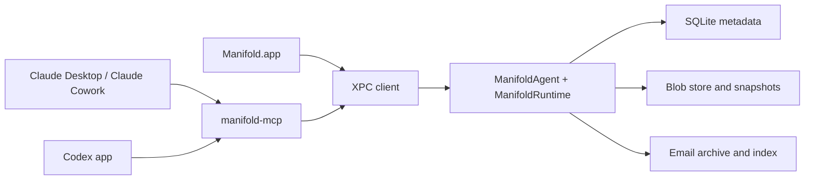
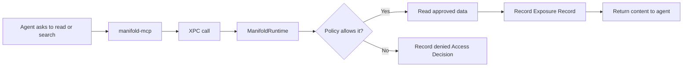
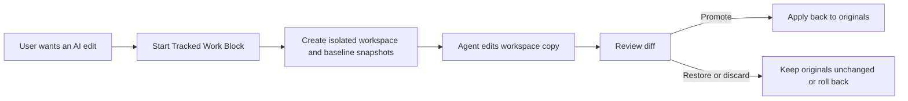

# Manifold Architecture

Manifold is the user-owned control plane that sits beside Claude and Codex, recording what they actually saw and changed on your Mac, across sessions and across vendors.

Architecturally, that means a local runtime and app surface for one core job: giving Claude and Codex controlled access to the files and emails the user chooses, while recording what was exposed and keeping reviewable edits in tracked workspaces.

This document explains the technical shape behind that product model.

## Product Model First

The architecture follows the product spec, not the other way around.

- **Per-Agent Access Policy**: Claude and Codex can have different file and email visibility.
- **Standing Access**: read and search through Manifold.
- **Tracked Work Block**: reviewable edits inside an isolated workspace.
- **Personal Data OS**: scoped memory, exposure evidence, capability handles, and claim verification for agent-visible context.
- **History Layer**: Access Decisions, Exposure Records, Version History, Memory, Ledger Entries, and Session Context.

The key rule is simple:

- `Standing Access` is for read/search.
- `Tracked Work Blocks` are for writes.

## Coverage Model

The runtime should make coverage explicit instead of implying more control than it has.

- **Manifold-Routed**: reads and searches that go through Manifold can be governed and recorded.
- **Tracked Workspace**: edits inside a tracked workspace can be snapshotted, reviewed, restored, promoted, or discarded.
- **Outside Coverage**: native activity outside the Manifold path is not fully governed by Manifold and should be surfaced honestly when detected.

Drift detection belongs in this model as a visibility layer, not as a claim of total enforcement.

## System Shape



The runtime is the source of truth. The app is a client of that runtime. The MCP server is also a client of that runtime.

## Main Components

### Manifold.app

The native SwiftUI app is the user-facing control surface.

It is responsible for:

- showing current file and email visibility
- showing activity, history, and coverage state
- starting and reviewing Tracked Work Blocks
- surfacing approvals, restores, drift, and version history

It is not the source of truth for policy or audit data.

### ManifoldAgent

`ManifoldAgent` is a bundled LaunchAgent helper that keeps the runtime available even when the main window is closed.

It is responsible for:

- hosting the XPC listener
- keeping the runtime alive
- owning the long-lived local service boundary

### ManifoldRuntime

`ManifoldRuntime` is the core of the system.

It is responsible for:

- policy decisions
- rule evaluation (files, emails, agent behavior) through `RuleEngine`
- audit and exposure recording
- workspace lifecycle
- snapshot and restore operations
- history and session context queries

This is the real judge in the system.

### Rule engine

`RuleStore` + `RuleEngine` live alongside `PolicyStore` and are consulted on every governed read:

- `RuleRecord` is one unified type across file, email, and agent-behavior rules. It carries `(scope, matcher, action, agents, window, priority, source)`.
- Precedence is two-phase: seeded denies sweep first (any matching deny wins over any matching allow), then first-match-wins within the same action. Seeded rules pin to the top of their group and are overridable only via an explicit user-override-allow with a banner warning.
- First launch imports any existing `EmailRuleSet` entries into `RuleStore` tagged `source = .imported` so the old email engine's decisions carry forward.
- `ManifoldBridge.enforceFileReadRules` calls `RuleEngine.evaluate(.fileRead(path), ...)` before returning file bytes. The email engine is re-pointed at the same store. Agent-behavior rules gate tool invocations and session duration.
- Each decision carries a matched rule ID and an explanation string the UI uses for "denied because rule X matched path Y" feedback.

### manifold-mcp

`manifold-mcp` is the V1 agent adapter.

It is responsible for:

- exposing Manifold tools to Claude Desktop/Cowork and Codex through MCP
- forwarding requests into the runtime over XPC
- staying thin rather than duplicating policy or storage logic

MCP is the first adapter, not the whole architecture.

## Trust Boundary

Manifold governs the path that goes through Manifold.

That means:

- if an agent reads or searches through `manifold-mcp`, the runtime can allow or deny it and record the outcome
- if an agent edits through a Tracked Work Block, the runtime can snapshot, review, restore, promote, or discard the changes

That does not mean:

- Manifold fully controls every native Claude or Codex capability
- Manifold fully controls computer use, vendor-hosted connectors, or arbitrary direct filesystem access outside its path

The architecture should always present that boundary honestly.

## Local Identity

The runtime does not trust a declared agent label by itself.

- `SignedProcessVerifier` checks the calling process against a code-signing requirement string before the XPC service accepts privileged calls. A forged `Claude` or `Codex` label on an unsigned or mismatched binary is rejected at the boundary.
- `ClientIdentityVerifier` binds callers to their XPC connection so a connection cannot silently switch identity mid-session.
- Agent identity fed into `RuleEngine` is the verified identity, not the self-reported one.

This matters because the product promise depends on the runtime being a real trust boundary, not just a cooperative protocol surface.

## On-Disk Protection

Governance data is sensitive enough to deserve defense in depth beyond SQLite file perms.

- `LocalFileProtection` owns the governance directory at 0o700 and writes new files at 0o600 so another local user cannot read them.
- `ProtectedStorageCrypto` encrypts selected payloads at rest with AES-GCM. The symmetric key is stored in the macOS Keychain with an access control list bound to this app. Encrypted files carry a `MNF1` magic header so future migrations can tell encrypted payloads from legacy plaintext without guessing.
- `ScopedFileIdentity` normalizes every caller-supplied path (resolves `..`, strips source-folder prefixes, rejects symlink escapes) before it reaches a policy check. This closes the class of bug where an agent asks for `shared/../.ssh/id_rsa` and the policy sees a "shared" path.
- `FileVisibilityOverrideStore` records per-agent file-level overrides (hide this file from Claude but keep it for Codex, for example) so rules and manual overrides cohere instead of fighting.
- `StandingWriteApprovalStore` holds the once vs. default answers to standing-write prompts so a user's choice in `Requests` survives session boundaries.

## Data and History

The runtime persists five kinds of product data:

- **Policy data**: what Claude and Codex are allowed to see
- **Exposure data**: what content was actually returned through Manifold
- **Workspace and snapshot data**: tracked edits, baselines, restores, promotions
- **Personal Data OS data**: scoped memory, capability handles, tool metrics, knowledge graph records, and fabrication findings
- **Session context**: nearby files, emails, and audit events that explain what a change was part of

At the storage level, that maps roughly to:

- SQLite for metadata, policy, audit records, and indexes
- content-addressed blobs for tracked file history
- local email archive and indexing for message history

## Personal Data OS Trust Layer

The Personal Data OS layer is the part of Manifold that turns selected files and emails into reusable agent context without silently widening authority.

- `MemoryStore` keeps user-owned memory with source/grant lineage. Agent-derived memory has an origin and optional retention expiry. Amnesiac mode blocks new agent-derived memory writes; retention tombstones expired derived memory as `expired_by_retention` instead of deleting history.
- `forget_memory` is scoped. The bridge loads the memory item first and only allows agent deletion when the memory belongs to the current grant or every source in its lineage is available in the current access context. Missing and out-of-scope IDs return the same denial.
- `CapabilityHandleStore` records sensitive value handles and allowed sinks. `check_capability_flow` now loads the handle before evaluation and rejects out-of-scope handles before sink or Rule-of-Two checks run.
- `LedgerStore` hashes new entries with stable timestamp material. Old entries that used the legacy no-timestamp hash still verify, but verification reports how many legacy rows are not timestamp-covered.
- `verify_claimed_actions` is strict. Only structured claims backed by scoped current-connection exposures can be `supported`; text-only, tool-only, resource-only, or loose-overlap claims are `ambiguous`; claims with no scoped evidence are `unverified`.

This keeps Manifold's claim narrow but strong: the runtime can prove what passed through Manifold, preserve the lineage of derived context, and refuse cross-scope mutation or capability checks.

## Read Path

The read path is intentionally simple.



Reads and searches should stay low-friction while still being auditable.

## Write Path

The write path is intentionally different from the read path.



In V1, reviewable writes should happen here rather than through direct writes to original files during Standing Access.

## Claude and Codex Context

The external app model matters because Claude and Codex do not expose local capability in the same way.

- **Claude Desktop / Claude Cowork**: local capability can come from desktop extensions, remote capability can come from hosted connectors, Cowork can run code in a VM, and computer use can act on the real desktop outside that VM.
- **Codex app**: work is project- or worktree-scoped, with sandbox and approval settings controlling read, edit, command, and network behavior.

This is why Manifold should be framed as a shared user-owned access and history layer, not as a claim to fully replace the native host models.

## Current Architectural Direction

The repo is already moving toward the right shape:

- one runtime as the judge
- thin adapter at the edge
- tracked workspaces for writes
- local history as a first-class feature

The main areas still being tightened are:

- clearer coverage visibility in the UI
- drift detection as a supplement to tracked workflows
- keeping MCP thin while avoiding premature adapter-framework complexity
- agent-rule features still UI-only: cost ceilings (need a token/$ ledger), content-entropy secret detector, suggested-rule ranking

## Package Layout

```text
Sources/
  ManifoldKit/       Core types, stores, database, snapshots, content storage
  ManifoldRuntime/   Runtime composition root and bridge logic
  ManifoldXPC/       XPC protocol, service, client, coding types
  ManifoldAgent/     LaunchAgent entry point
  ManifoldMCP/       MCP adapter
  ManifoldCLI/       Local utility client

ManifoldApp/
  ManifoldApp/       SwiftUI app
```

## Build Basics

```bash
swift build
swift test
swift build --product ManifoldAgent
```

Open `Manifold.xcodeproj` to work in Xcode.

## Related Documents

- [design/PRODUCT-SPEC.md](design/PRODUCT-SPEC.md)
- [design/README.md](design/README.md)
- [design/RUNTIME-MIGRATION.md](design/RUNTIME-MIGRATION.md)
- [design/WHY-RUNTIME.md](design/WHY-RUNTIME.md)
