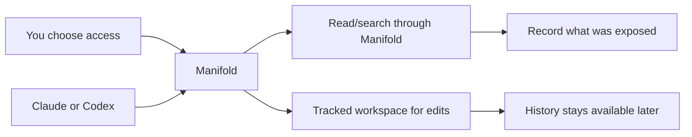

[](LICENSE)
[](.github/workflows/ci.yml)

# Manifold

Give AI agents a copy of your project, not your whole Mac.

Manifold is a local macOS app and runtime for giving AI tools controlled access to the files and email you choose, with reviewable workspaces, durable history, and a clear audit trail of what was exposed.

## What It Does

- Isolates agent work in controlled project copies instead of granting broad machine access
- Applies per-agent access controls for files, folders, and governed email access
- Keeps full local version history for tracked edits, snapshots, restores, and promotion flows
- Records a cross-agent audit trail of reads, searches, and exposures routed through Manifold
- Supports a review, restore, and promote workflow so governed work stays inspectable

<!-- TODO: Add screenshot -->

## Quick Start

```bash
git clone <repo-url>
cd Manifold
swift build
swift test
open Manifold.xcodeproj
```

For app changes, you can also verify the Xcode target from the command line:

```bash
xcodebuild -project Manifold.xcodeproj -scheme Manifold -configuration Debug build CODE_SIGNING_ALLOWED=NO
```

## Architecture

Manifold combines a native SwiftUI app, a local runtime, tracked workspaces, and an MCP bridge so agent activity can be governed locally instead of flowing through unconstrained machine access.



See [ARCHITECTURE.md](ARCHITECTURE.md) for the full system design.

## Current Status

Early development. Core runtime is stable with 230+ tests. UI is under active development.

## Known Limitations

- macOS only
- Local-only runtime and agent integration path
- No real-time blocking for native activity outside the Manifold path
- Unsigned local builds require per-developer signing choices for full app runs

## Contributing

See [CONTRIBUTING.md](CONTRIBUTING.md) for setup, verification, and pull request guidance.

## License

Licensed under the Apache License, Version 2.0. See [LICENSE](LICENSE).
