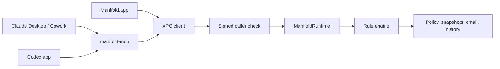

[](LICENSE)
[](.github/workflows/ci.yml)

# Manifold

Give AI agents a copy of your project, not your whole Mac.

Manifold is the user-owned control plane that sits beside Claude and Codex, recording what they actually saw and changed on your Mac when their work goes through Manifold.

It is a local macOS app and runtime for giving AI tools controlled access to the files and email you choose through Manifold, with reviewable workspaces, durable history, and a clear audit trail of what was exposed.

## Can I Use It?

Manifold is currently for people who can run a modern local macOS build:

- macOS 26.0 or later
- Xcode 26.0 or later
- Swift 6
- local signing configured in Xcode for the app target

If that fits your setup, you can clone, build, and run the app locally today.

## What It Does

- Lets you choose which files, folders, and emails Claude can see through Manifold
- Lets you choose separately what Codex can see through Manifold
- Enforces a unified rule system across files, emails, and agent behavior, with seeded denies for secrets (`.env`, `.ssh/**`, private keys) that cannot be accidentally opened up
- Records what was actually exposed through the governed Manifold path
- Routes reviewable edits through tracked workspaces instead of direct writes to originals
- Keeps local version history and session context across sessions and across agents
- Stores governance data on disk with owner-only permissions and AES-GCM encryption keyed from the Keychain
- Verifies XPC callers against code-signing requirements instead of trusting declared agent labels
- Stays explicit about its boundary: native activity outside the Manifold path is outside Manifold's control

<!-- TODO: Add screenshot -->

## Quick Start

```bash
git clone <repo-url>
cd Manifold
swift build
swift test
open Manifold.xcodeproj
```

Then run the `Manifold` scheme in Xcode.

For a shell-first verification pass, you can also build the app target from the command line:

```bash
xcodebuild -project Manifold.xcodeproj -scheme Manifold -configuration Debug build CODE_SIGNING_ALLOWED=NO
```

For the full first-run walkthrough, see [docs/getting-started.md](docs/getting-started.md).

## Architecture

Manifold combines a native SwiftUI app, a local runtime, tracked workspaces, and an MCP bridge so access routed through Manifold can be governed locally instead of flowing through unconstrained machine access.



The main window is a single ledger with five destinations — `Activity`, `Access`, `Mail`, `Requests`, and `Rules` — all backed by the same runtime. `Rules` is not a preview; edits there change real file-read, email, and agent-behavior decisions.

See [docs/architecture.md](docs/architecture.md) for the outsider-friendly system view and [ARCHITECTURE.md](ARCHITECTURE.md) for the deeper architecture document.

## Docs

### Use It

- [docs/getting-started.md](docs/getting-started.md)
- [design/CLAUDE-CODEX-TESTING.md](design/CLAUDE-CODEX-TESTING.md)

### Understand It

- [docs/architecture.md](docs/architecture.md)
- [docs/ui-map.md](docs/ui-map.md)
- [docs/mcp-integration.md](docs/mcp-integration.md)
- [docs/design-decisions.md](docs/design-decisions.md)

### Contribute To It

- [CONTRIBUTING.md](CONTRIBUTING.md)
- [design/PRODUCT-SPEC.md](design/PRODUCT-SPEC.md)
- [design/README.md](design/README.md)

## Current Status

Early development, but already usable for local builds. The runtime, app tests, and fixture-mode UI tests are in place, and the main product model is now in the codebase.

## Known Limitations

- macOS only
- Local-only runtime and agent integration path
- No real-time blocking for native activity outside the Manifold path
- Unsigned local builds require per-developer signing choices for full app runs

## How To Get Help

- Start with [docs/getting-started.md](docs/getting-started.md) if you want to run it
- Use [design/CLAUDE-CODEX-TESTING.md](design/CLAUDE-CODEX-TESTING.md) if you want to test live Claude/Codex integration
- Read [CONTRIBUTING.md](CONTRIBUTING.md) if you want to change code
- Read [design/PRODUCT-SPEC.md](design/PRODUCT-SPEC.md) if you want the canonical product definition

## Contributing

See [CONTRIBUTING.md](CONTRIBUTING.md) for setup, verification, and pull request guidance.

## License

Licensed under the Apache License, Version 2.0. See [LICENSE](LICENSE).
