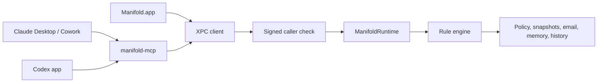

<p align="center">
  <picture>
    <source media="(prefers-color-scheme: dark)" srcset="brand/mark-dark.svg">
    
  </picture>
</p>

<h1 align="center">Manifold</h1>

<p align="center"><strong>Give AI agents a copy of your project, not your whole Mac.</strong></p>

<p align="center">
  <a href="LICENSE"></a>
  
  
</p>

---

Manifold is the user-owned control plane that sits beside Claude and Codex, recording what they actually saw and changed on your Mac when their work goes through Manifold.

It is a local macOS app and runtime for giving AI tools controlled access to the files and email you choose through Manifold, with reviewable workspaces, durable history, and a clear audit trail of what was exposed.

The mark `{ | }` is the product thesis as a glyph. Curly braces are the trust boundary; the bar between them is the content authority that flows through. See [DESIGN.md](DESIGN.md#brand-mark) and [`brand/`](brand/) for the brand work.

## Can I Use It?

Manifold is currently for people who can run a modern local macOS build:

- macOS 26.0 or later
- Xcode 26.0 or later
- Swift 6
- local signing configured in Xcode for the app target

If that fits your setup, you can clone, build, and run the app locally today.

## What It Does

- Lets you choose, per AI, which files, folders, and emails Claude (Desktop, Cowork, Claude Code) and Codex CLI can see through Manifold. The Folders matrix and Files list show one chip per connected AI inline so you never have to switch a "target agent" dropdown.
- Drag a folder from Finder to add it as a source; drag a file and Manifold asks whether to add the whole folder or just that file (siblings denied via per-file overrides).
- Mail surface mirrors Files: per-message chip stack, scrollable message excerpts in the inspector, and explicit export when readable `.eml` files are needed.
- Sharing column on each folder reads as plain English — `Not shared`, `Shared with Claude`, `Partly shared · 1 of 2`, `Shared with all` — with a small dot when individual files inside have explicit allow/deny overrides.
- Enforces a unified rule system across files, emails, and agent behavior, with seeded denies for secrets (`.env`, `.ssh/**`, private keys) that cannot be accidentally opened up
- Records what was actually exposed through the governed Manifold path
- Routes reviewable edits through tracked workspaces instead of direct writes to originals
- Keeps local version history and session context across sessions and across agents
- Lets agents build scoped, user-governed memory from selected files and emails, with amnesiac mode and retention enforced by the runtime
- Verifies structured agent claims against scoped exposure records so weak text-only claims stay ambiguous instead of being treated as proof
- Stores governance data on disk with owner-only permissions and AES-GCM encryption keyed from the Keychain
- Verifies XPC callers against code-signing requirements instead of trusting declared agent labels
- Stays explicit about its boundary: native activity outside the Manifold path is outside Manifold's control

<!-- TODO: Add screenshot -->

## Quick Start

```bash
git clone <repo-url>
cd Manifold
swift build
swift test
open Manifold.xcodeproj
```

Then run the `Manifold` scheme in Xcode.

For a shell-first verification pass, you can also build the app target from the command line:

```bash
xcodebuild -project Manifold.xcodeproj -scheme Manifold -configuration Debug build CODE_SIGNING_ALLOWED=NO
```

For the full first-run walkthrough, see [docs/getting-started.md](docs/getting-started.md).

## Architecture

Manifold combines a native SwiftUI app, a local runtime, tracked workspaces, and an MCP bridge so access routed through Manifold can be governed locally instead of flowing through unconstrained machine access.



The main window is a single ledger with five destinations — `Activity`, `Access`, `Mail`, `Requests`, and `Rules` — all backed by the same runtime. `Rules` is not a preview; edits there change real file-read, email, and agent-behavior decisions.

The Personal Data OS layer now treats memory, capability handles, ledger entries, and claimed-action verification as runtime-governed data. Agents can only forget memory or evaluate capability handles that belong to their current grant/source scope, derived memory honors runtime retention policy, and ledger verification reports whether older rows predate timestamp-covered hashes.

See [docs/architecture.md](docs/architecture.md) for the outsider-friendly system view and [ARCHITECTURE.md](ARCHITECTURE.md) for the deeper architecture document.

## Docs

### Use It

- [docs/getting-started.md](docs/getting-started.md)
- [docs/claude-codex-testing.md](docs/claude-codex-testing.md)

### Understand It

- [docs/architecture.md](docs/architecture.md)
- [docs/ui-map.md](docs/ui-map.md)
- [docs/mcp-integration.md](docs/mcp-integration.md)
- [docs/design-decisions.md](docs/design-decisions.md)

### Contribute To It

- [CONTRIBUTING.md](CONTRIBUTING.md)
- [docs/product-spec.md](docs/product-spec.md)
- [docs/design/README.md](docs/design/README.md)

## Current Status

Early development, but already usable for local builds. The runtime, app tests, and fixture-mode UI tests are in place, and the main product model is now in the codebase.

## What Manifold governs (and what it doesn't)

Manifold governs the path that goes through `manifold-mcp`. AI tools
that connect via MCP and call `manifold.*` tools get per-agent policy,
exposure recording, cross-agent memory, and reviewable writes via
tracked workspaces.

Supported MCP clients today (configured automatically by
`manifold-mcp --install`):

- **Claude Desktop** — `~/Library/Application Support/Claude/claude_desktop_config.json`
- **Claude Cowork** — same registration as Claude Desktop
- **Claude Code (CLI)** — `~/.claude/settings.json`
- **Codex CLI** — `~/.codex/config.toml`

The same install also writes `~/CLAUDE.md` and `~/.codex/AGENTS.md`
with a Manifold-managed Markdown block that nudges these tools toward
`manifold.*` tools (managed section, idempotent across re-installs,
preserves your existing rules).

What Manifold **does not** govern (intentionally surfaced):

- System shell, network requests, and direct filesystem reads outside
  approved Manifold sources. AI tools with native shell or file tools
  can bypass Manifold by using those tools instead. The rules file
  nudges them away from this; nothing enforces it.
- Computer use / vision capabilities (e.g., Claude controlling the
  mouse). Outside Manifold's process boundary entirely.
- Vendor-hosted connectors and remote-tool calls that happen on the
  vendor's infrastructure rather than your machine.
- AI tools that don't support MCP (e.g., older Aider versions, raw API
  scripts). No installation point, no governance.

## Known Limitations

- macOS only
- Local-only runtime and agent integration path
- No real-time blocking for native activity outside the Manifold path
- Unsigned local builds require per-developer signing choices for full app runs

## How To Get Help

- Start with [docs/getting-started.md](docs/getting-started.md) if you want to run it
- Use [docs/claude-codex-testing.md](docs/claude-codex-testing.md) if you want to test live Claude/Codex integration
- Read [CONTRIBUTING.md](CONTRIBUTING.md) if you want to change code
- Read [docs/product-spec.md](docs/product-spec.md) if you want the canonical product definition

## Contributing

See [CONTRIBUTING.md](CONTRIBUTING.md) for setup, verification, and pull request guidance.

## License

Licensed under the Apache License, Version 2.0. See [LICENSE](LICENSE).
