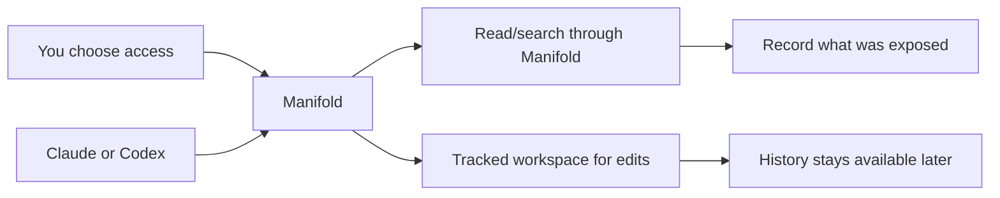

# Manifold

Controlled access for Claude and Codex on your Mac.

Manifold is a local macOS app that makes it easy to give Claude and Codex controlled access to the files and emails you choose. It records what was actually exposed through that access path, keeps reviewable AI edits in tracked workspaces, and turns that history into durable local context for future AI work.

## What It Is

Manifold gives the user, not the AI vendor, the system of record for AI work on their own machine.

It does four things:

- lets you choose which files and emails Claude can access
- lets you choose separately what Codex can access
- records what content was actually returned through Manifold
- keeps AI edits reviewable, restorable, and useful later

## The Model

**Per-agent control → recorded exposure → tracked edits → durable context**



## How It Works

1. You choose which files, folders, and emails each agent can see.
2. Reads and searches go through Manifold and are recorded.
3. Reviewable edits happen in a tracked workspace, not directly in original files.
4. The resulting history stays on your Mac for later sessions.

## Coverage

Manifold is honest about what it governs.

- **Manifold-Routed**: reads and searches that go through Manifold are governed and recorded.
- **Tracked Workspace**: reviewable edits happen in an isolated workspace with snapshots and restore.
- **Outside Coverage**: native agent activity outside the Manifold path is not fully governed by Manifold, and the app should show that boundary clearly.

## Claude and Codex

Manifold is designed around the macOS Claude and Codex apps, which have different native models.

- **Claude Desktop / Claude Cowork**: Claude can gain local capability through desktop extensions, remote capability through hosted connectors, and in Cowork can work in a VM or act on the real desktop through computer use.
- **Codex app**: Codex works from the current project or a managed worktree, with sandbox and approval settings that constrain what it can read, edit, and run.
- **Manifold in V1**: MCP is the first shared integration path, backed by a local runtime, tracked workspaces, audit/history storage, and approval flow.

## Architecture At A Glance

- `Manifold.app`: native SwiftUI app for access control, activity, versions, and review
- `ManifoldAgent`: bundled LaunchAgent that keeps the runtime available
- `ManifoldRuntime`: local source of truth for policy, audit, snapshots, and history
- `manifold-mcp`: thin MCP adapter that forwards agent requests into the runtime over XPC
- `SQLite + blob storage`: local metadata, audit records, and tracked file history

Start with [design/PRODUCT-SPEC.md](design/PRODUCT-SPEC.md) for the April 13, 2026 product model, then read [ARCHITECTURE.md](ARCHITECTURE.md) for the runtime shape and [design/README.md](design/README.md) for the current design/runtime document map.

## Current State

Early development. The core runtime, tracked workspace model, app shell, and audit/history primitives exist. The main areas still being tightened are caller identity, coverage visibility, and drift detection.

## Building

```bash
swift build
swift test
swift build --product ManifoldAgent
```

Open `Manifold.xcodeproj` to work in Xcode.

## Testing with Claude and Codex

For the real governed-path test loop, use [design/CLAUDE-CODEX-TESTING.md](design/CLAUDE-CODEX-TESTING.md).

This repo now also includes:

- [script/build_and_run.sh](script/build_and_run.sh) — repeatable local build and run loop for Xcode builds
- [.codex/environments/environment.toml](.codex/environments/environment.toml) — Codex desktop `Run` action wiring

## License

See `LICENSE`.
