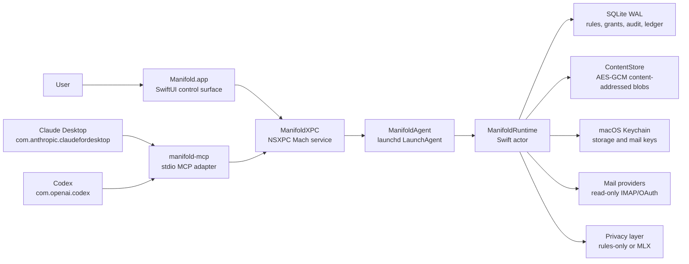
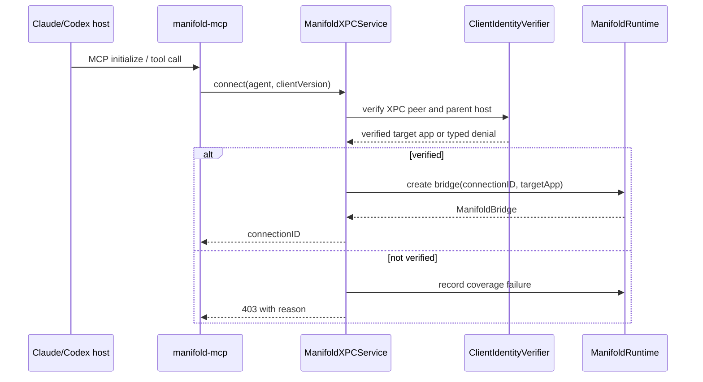
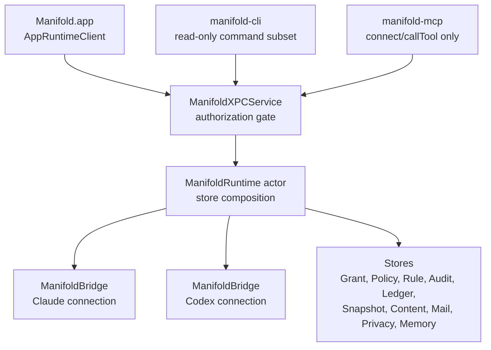
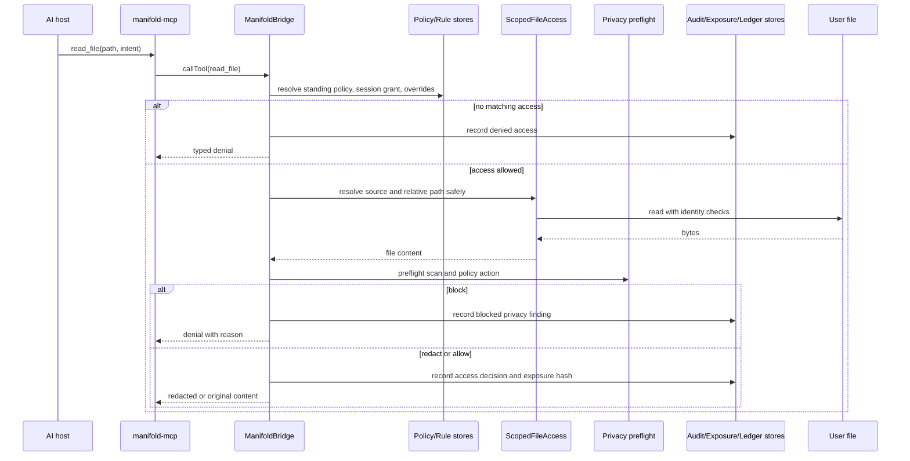
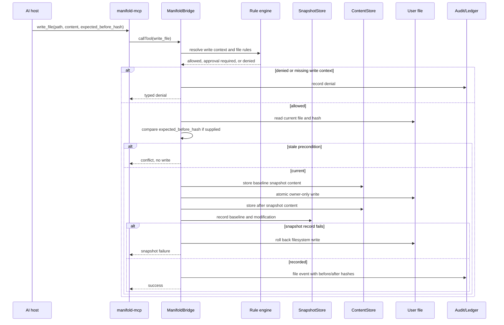
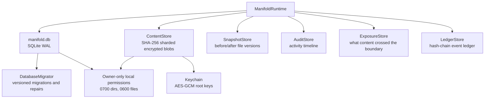
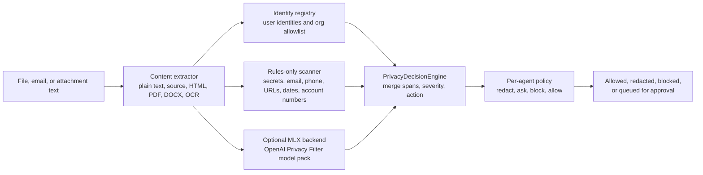
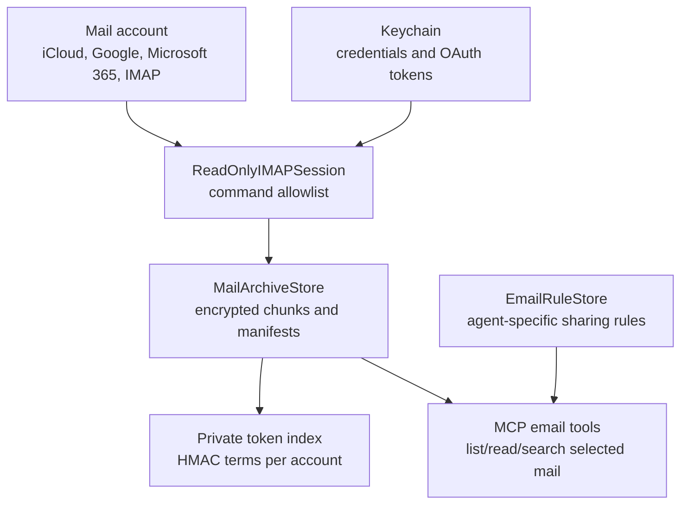
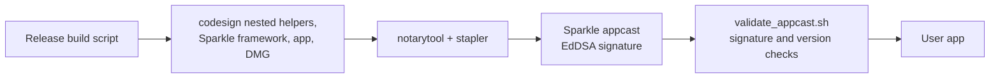

# Manifold Technical Architecture

This document describes the current Manifold architecture as implemented in
the repository for the `0.4.0` release.

Manifold is a local macOS governance layer between AI desktop agents and the
user's files, mail, memory, and audit trail. The important constraint is not
"the AI is trusted after setup." The constraint is narrower: when Claude or
Codex uses the Manifold MCP server, every read and write is mediated by the
runtime, checked against local policy, and recorded locally.

## The Short Version

There are three process roles:

| Process | Role | Why it exists |
| --- | --- | --- |
| `Manifold.app` | User-facing control plane. Onboarding, settings, approvals, sources, mail review, audit views. | The UI should not own policy execution or open the database directly. It asks the runtime over XPC. |
| `ManifoldAgent` | Background runtime host launched by `launchd`. | Runtime work needs to outlive individual windows and stay available to MCP clients. |
| `manifold-mcp` | Thin stdio MCP adapter for Claude and Codex. | AI hosts already speak MCP. The adapter keeps host integration small and puts policy in one place. |

The libraries follow the same separation:

| Module | Responsibility |
| --- | --- |
| `ManifoldXPC` | Typed XPC protocol, caller verification, app-command authorization. |
| `ManifoldRuntime` | Governance, bridge dispatch, privacy preflight, mail sync, snapshot lifecycle. |
| `ManifoldKit` | Shared types and stores: rules, grants, audit, ledger, storage, mail archive, diagnostics. |
| `ManifoldMCP` | MCP tool/resource definitions and stdio server. |
| `ManifoldCLI` | Read-only admin shell for status, activity, and source listing. |

## Design Goals

1. Put a local policy boundary in front of AI reads and writes.
2. Make the boundary visible: the user can see what was exposed and what was
   changed later, even in a different chat or a different AI app.
3. Keep sensitive local state local. Rules, grants, exposure records,
   snapshots, mail archives, and diagnostics live under the user's account.
4. Fail closed when caller identity, path identity, policy, privacy preflight,
   or write preconditions are not clear enough.
5. Use ordinary macOS primitives that users and maintainers can inspect:
   `launchd`, XPC, code signing, Keychain, SQLite, file permissions, Sparkle.

## Non-Goals

Manifold does not make every Claude or Codex action on the machine pass through
Manifold. It governs traffic routed through the configured `manifold-mcp`
server. If an AI host has another tool, another MCP server, or direct
filesystem permissions outside Manifold, that path is outside this boundary.

Manifold is not a kernel extension and the current code does not implement an
Endpoint Security client or APFS filesystem snapshots. The enforced boundary
reviewed here is the MCP adapter, XPC service, code-signing verification,
runtime policy engine, scoped file APIs, and local storage layer.

Manifold is also not a DLP oracle. The privacy layer can redact, warn, block,
index, and explain decisions, but it can still have false positives and false
negatives. The design assumes policy and auditability are necessary even when
classification is imperfect.

## Trust Boundaries

The XPC surface is deliberately small:

| XPC method | Caller | Purpose |
| --- | --- | --- |
| `connect` | `manifold-mcp` only | Create a runtime bridge for a verified Claude or Codex host. |
| `callTool` | Connected `manifold-mcp` bridge | Execute one governed MCP tool. |
| `disconnect` | Connected `manifold-mcp` bridge | Tear down bridge state. |
| `command` | Manifold app, and limited CLI | App control-plane commands; CLI is read-only. |

`ClientIdentityVerifier` handles the local trust decision:

- The XPC peer for MCP traffic must be an executable named `manifold-mcp`.
- The parent host bundle maps to a known target app:
  `com.anthropic.claudefordesktop` for Claude and `com.openai.codex` for
  Codex.
- The helper and host are checked through Security.framework code-signing
  APIs, including designated requirements and team identifiers when available.
- The Manifold app bundle can call privileged app commands only after the same
  team/signature checks.
- `manifold-cli` is limited to read-only status commands.
- `manifold-mcp` is explicitly rejected from the app-command path.

Why this choice: MCP gives Claude and Codex a shared integration point, but MCP
alone does not identify who is on the other end. XPC gives the runtime a local
process boundary with peer information. Code-signing checks keep a random local
process from pretending to be the installed helper or the Manifold app.

The cost: this is Mac-specific. The implementation depends on macOS process
identity, `launchd`, Keychain, and Security.framework behavior.

## Runtime Ownership

`ManifoldRuntime` is a Swift actor. It composes the stores and creates one
`ManifoldBridge` per verified MCP connection. The app does not open the
governance database. MCP clients do not open the governance database. The
agent process owns the stores.

Why this choice: one runtime owner avoids split-brain policy and storage
decisions. It also keeps long-running jobs such as mail sync, privacy indexing,
snapshot pruning, and approval expiry out of the UI process.

The app still owns user intent. It starts/stops the LaunchAgent, installs the
bundled MCP helper, writes MCP config, shows diffs and approvals, and updates
settings through XPC commands.

## Read Path

A file read is not a filesystem read by the AI host. It is a tool call that
must resolve through policy and privacy checks.

Important details:

- Source paths are resolved by `ScopedFileAccess` and `ScopedFileIdentity`.
  Absolute paths, `..`, symlinks in governed paths, hard-linked regular files,
  and paths outside the source root are rejected.
- Reads detect identity changes while reading.
- Rule evaluation has a deny-wins pass before allow/warn/redact/summarize
  actions are applied.
- Exposure records include content hash, byte count, resource path, decision,
  tool name, agent, and a redacted preview.
- Tool metrics and selected runtime events are also appended to the ledger.

Why this choice: the most useful audit question is not "was the tool called?"
It is "what exact content did the AI receive?" The content hash and exposure
record make that question answerable without storing every exposed plaintext
copy in the audit row.

## Write Path

Writes have a different contract from reads. Standing access mainly grants
visibility. State-changing operations require write context and additional
checks.

The write implementation also limits blast radius:

- Text writes reject binary/document/archive/media extensions.
- Binary writes are size-limited.
- PDF annotation is bounded by file size and page count.
- `_emails/` paths are blocked from file writes.
- The runtime searches proposed write content for high-risk secrets such as
  private keys and common API token formats.
- `expected_before_hash` lets the host prove it is editing the version it
  inspected.
- If snapshot versioning fails after the filesystem write, the runtime attempts
  to roll the file back.

Why this choice: writes are where governance becomes visible. The runtime needs
to preserve the user's ability to answer three questions later: what changed,
what was the previous version, and which AI/session/tool caused it.

## Access Model

Manifold has several access layers because "share this folder" and "let this
AI rewrite this file now" are different operations.

| Layer | Meaning | Typical owner |
| --- | --- | --- |
| Source | A user-approved local root. | User/app. |
| Standing policy | Default per-agent file/email visibility. | User/app. |
| File visibility override | Per-agent allow/deny inside a source. | User/app. |
| Session grant | Time-scoped selected files/emails and intent. | User/app. |
| Tracked work block | Write/review/promotion lifecycle. | Runtime/app. |
| Email rule set | Per-agent domain/contact/keyword/shield policy. | User/app. |
| Privacy policy | Per-agent action for privacy findings. | User/app. |

The runtime resolves from the narrowest relevant access first. If nothing
matches, it denies.

Why this choice: a single ACL is not enough. Agents need short-lived work
contexts, long-lived defaults, explicit exceptions, and different behavior for
mail and files. Encoding these as separate records keeps the UI honest: read
scope, write scope, and mail scope are not the same knob.

## Rule Engine

The rule engine is stateless. It evaluates file, email, content, and agent
rules from stored records and seeded defaults. Seeded rules block common
sensitive paths and content classes: environment files, private keys, SSH/GPG
material, cloud credentials, secret detector hits, security/financial/medical
mail, and one-time-code subjects.

Rules can allow, deny, warn, redact, summarize, downgrade, or log. Deny wins
first. Remaining matches are ordered by group priority, source order, and
creation time.

Why this choice: rule decisions need to be explainable and reproducible. A
pure evaluator with explicit precedence is easier to test and easier to show
in audit output than scattered `if` checks at every tool implementation.

## Local Storage

The database is SQLite with WAL mode, `SQLITE_OPEN_FULLMUTEX`, foreign keys,
and an 8 MB page cache. Stores share one connection. Swift actors structure
access at the application level, and SQLite serializes calls at the connection
level.

The content store is content-addressed by SHA-256. Blobs are encrypted with
AES-GCM using a symmetric key stored in the macOS Keychain. Directories are
owner-only. Files are owner-only. Mail archives use a separate account-derived
key hierarchy and authenticated manifests.

Why this choice:

- SQLite is enough for local policy, audit, and index data. It also keeps the
  storage model inspectable for contributors.
- WAL reduces writer/reader contention for a local app with background jobs.
- A single shared connection avoids cross-connection migration and transaction
  surprises.
- Content-addressed blobs deduplicate snapshots and make integrity checks
  straightforward.
- Keychain-backed AES-GCM protects local sensitive blobs at rest without
  introducing an account service.

The tradeoff: WAL with `synchronous=NORMAL` favors local performance. It is
appropriate for an app-owned cache/governance store, but it does not promise
that the last transaction survives every sudden power-loss case.

## Audit, Exposure, and Ledger

Manifold keeps three related records:

| Store | Answers |
| --- | --- |
| `AuditStore` | What happened in the user timeline? |
| `ExposureStore` | What content was allowed, denied, redacted, or blocked for an agent? |
| `LedgerStore` | Has the event chain been modified out of order? |

The ledger is a hash chain. Each entry records sequence, timestamp, type,
subject, previous hash, payload hash, entry hash, and metadata. Verification
streams entries in pages instead of loading the whole table into memory.

Why this choice: the audit log is for people. Exposure records are for
forensics. The ledger gives the app a cheap tamper-evidence check over events
without pretending to be an append-only remote log.

## Privacy Architecture

Privacy handling has two paths: inline preflight and background indexing.

Inline preflight runs before content is delivered to an agent when privacy
preflight is enabled. The default backend is rules-only unless the MLX runtime
is installed and selected. The MLX model pack is pinned by repository snapshot
and verified with SHA-256 checksums during install. If the preferred backend
fails, the runtime falls back to rules-only rather than sending unchecked
content.

Background indexing scans sources, emails, and attachments for privacy
discovery. It uses FSEvents for source changes, email sync events for mail, and
bounded batch processing. Extractors cap large text inputs and use platform
tools where available: PDFKit text extraction, Vision OCR, and DOCX XML
extraction.

Why this choice:

- Inline preflight protects the boundary at the moment content would leave
  Manifold.
- Background indexing gives the UI useful review surfaces before a prompt is
  in flight.
- Rules-only fallback keeps privacy behavior available on machines without the
  MLX pack.
- A pinned local model avoids sending file or mail content to a remote
  classifier. Installing the model pack is still a network download from
  Hugging Face unless the user supplies a local package.

## Mail Architecture

Mail is indexed locally and shared explicitly. Inbox access is not implied by
granting a source folder.

The IMAP layer whitelists read-only commands such as `EXAMINE`, `UID SEARCH`,
and `UID FETCH`. Mutating commands such as `STORE`, `COPY`, `MOVE`, `APPEND`,
`EXPUNGE`, `DELETE`, and `CREATE` are rejected. FETCH body access is rewritten
toward `BODY.PEEK` behavior so sync does not mark messages as read.

Credentials live in Keychain. For app-to-agent handoff, the app writes a
pending Keychain item and sends only the pending ID across XPC. The agent
validates and renames the item. Stale pending entries are swept on launch.

The search index stores HMAC terms instead of raw body tokens. The archive uses
account-local derived keys, authenticated chunks, manifests, staging, promotion,
and verification after write.

Why this choice: mail bodies and search terms are sensitive even when no AI has
seen them. A raw inverted index would become a second copy of the inbox. HMAC
terms still allow local search while avoiding a plaintext token database.

## Memory, Skills, Exec, and Capability Handles

Manifold includes higher-level agent features, but they keep the same boundary:

- Memory is scoped. File-derived memory is visible only when its contributing
  sources are inside the current scope. Cross-agent memory must satisfy the
  same source checks. Session grants can enable or disable memory access.
- Skills are stored as versioned manifests by hash. Invocation goes through
  the same governed execution planner.
- `run_code` is not a shell. It accepts deterministic JSON plans over a small
  operation set such as structured search, graph query, recall/reuse, ledger
  verification, and tool-cost reporting. Raw Python, shell, JavaScript,
  network, filesystem, and state-changing operations are refused.
- Capability handles track origin, sensitivity, trust, allowed sinks, and
  lineage. Sensitive untrusted state-changing flows can require approval under
  the Rule-of-Two check.

Why this choice: once an AI can run arbitrary code, the file policy boundary is
easy to bypass. The current execution surface is intentionally less general
than a REPL.

## Update and Release Path

Release builds are Developer ID signed, hardened-runtime enabled, notarized,
and distributed as DMGs. Sparkle provides updates.

Automatic update checks default to off. The user can run a manual update check,
or opt in to automatic checks. Sparkle is only started when the bundle has both
an update feed URL and a public EdDSA key. Before Sparkle relaunches the app,
the updater asks the store to boot out the runtime agent so the next launch
does not mix a new app with an old helper process.

The app also compares bundled and installed `manifold-mcp` helpers by code
identity. It uses CDHash and team identifier rather than raw bytes, so debug
or release rebuild noise does not force needless helper restarts. If a running
helper is stale, the UI can terminate only helpers whose executable path
matches the installed helper path.

Why this choice: Manifold's local trust checks depend on code identity. Update
logic has to handle the main app, LaunchAgent, and MCP helper as one release
unit, not as unrelated binaries.

## Performance Choices

The main performance constraint is not raw throughput. It is keeping policy
checks, audit recording, privacy scanning, and UI refresh responsive enough
that users do not route around the tool.

| Choice | Reason |
| --- | --- |
| Swift actors for runtime and bridges | Clear ownership for mutable runtime state and async tool calls. |
| SQLite WAL with one shared FULLMUTEX connection | Predictable local storage with enough concurrency for UI, MCP, mail sync, and index jobs. |
| Policy caches keyed by update signatures | Avoid recomputing standing policy for repeated file listings. |
| Streaming file hashes | Avoid reading large files into memory just to identify content. |
| Content-addressed blob store | Deduplicate snapshots and make snapshot lookup cheap by hash. |
| Bounded tool limits | Prevent a tool call from turning into unbounded memory, PDF, or binary processing. |
| Privacy preflight cache | Avoid rescanning identical content under the same backend/model/policy. |
| FSEvents and batched privacy indexing | Track source changes without full rescans on every launch. |
| XPC invalidation notifications plus ping backoff | UI reacts quickly to runtime disconnects without tight polling loops. |

The hard limits are part of the architecture. They are not only UX choices.
They make denial safer than partial parsing when an input is too large or too
ambiguous to govern confidently.

## Diagnostics and Telemetry

Diagnostics are local and export-only in the current implementation. The app
records local events such as launches, runtime registration failures, update
failures, and unexpected agent exits. Users can preview and save a JSON report.
`canSendReports` is false and no upload transport is wired.

Automatic Sparkle checks are a separate user preference and default to off.
Manual update checks are allowed because the user requested them directly.

The privacy manifest declares diagnostic and interaction categories required
for the app surface, but the implemented diagnostics model does not send those
records to a product telemetry endpoint.

Why this choice: for a tool whose purpose is governing AI access to local data,
implicit product telemetry would be a design contradiction. Local diagnostics
still matter for support, but export keeps the user in the loop.

## Security Posture Summary

Manifold's security posture is a set of smaller decisions rather than one
large sandbox claim:

- Local XPC boundary instead of direct database/file access by AI tools.
- Code-signing and host-bundle verification for MCP connections.
- Privileged app commands restricted to the signed Manifold app.
- CLI limited to read-only status commands.
- Default-deny behavior when policy or path resolution is unclear.
- Scoped path resolution that rejects traversal, symlink escapes, hard-link
  ambiguity, and identity changes during reads/writes.
- Owner-only local directories and files.
- AES-GCM encrypted blob storage with keys in Keychain.
- Separate Keychain handling for mail credentials and pending credential
  handoff.
- Read-only IMAP command enforcement.
- Seeded rules for secrets and sensitive mail classes.
- Optional on-device privacy preflight with rules-only fallback.
- Snapshots and rollback for governed writes.
- Hash-chain ledger for tamper-evidence over runtime events.
- Signed and notarized release artifacts with EdDSA-signed Sparkle updates.

What this does not protect against:

- AI access paths that do not use Manifold.
- A user intentionally granting broad access and approving unsafe writes.
- Malware already running as the user that can read the same files outside
  Manifold.
- A compromised mail provider account.
- All privacy classification errors.
- Physical access to an unlocked account.

## Source Map

These are the main files behind the architecture:

| Area | Files |
| --- | --- |
| Runtime entry point | `Sources/ManifoldAgent/main.swift` |
| XPC protocol and service | `Sources/ManifoldXPC/ManifoldXPCProtocol.swift`, `Sources/ManifoldXPC/ManifoldXPCService.swift` |
| Caller verification | `Sources/ManifoldXPC/ClientIdentityVerifier.swift`, `Sources/ManifoldXPC/SignedProcessVerifier.swift` |
| Runtime composition | `Sources/ManifoldRuntime/ManifoldRuntime.swift` |
| MCP bridge and tools | `Sources/ManifoldRuntime/ManifoldBridge.swift`, `Sources/ManifoldMCP/ToolDefinitions.swift`, `Sources/ManifoldMCP/ManifoldMCPServer.swift` |
| Path safety | `Sources/ManifoldKit/ScopedFileIdentity.swift` |
| Rules | `Sources/ManifoldKit/RuleEngine.swift`, `Sources/ManifoldKit/RuleSeed.swift`, `Sources/ManifoldKit/RuleTypes.swift` |
| Database | `Sources/ManifoldKit/DatabaseConnection.swift`, `Sources/ManifoldKit/DatabaseMigrator.swift` |
| Content and snapshots | `Sources/ManifoldKit/ContentStore.swift`, `Sources/ManifoldKit/SnapshotStore.swift`, `Sources/ManifoldKit/ProtectedStorageCrypto.swift` |
| Audit and ledger | `Sources/ManifoldKit/AuditStore.swift`, `Sources/ManifoldKit/ExposureStore.swift`, `Sources/ManifoldKit/LedgerStore.swift` |
| Privacy | `Sources/ManifoldRuntime/PrivacyPreflightCoordinator.swift`, `Sources/ManifoldRuntime/PrivacyBackends.swift`, `Sources/ManifoldRuntime/MLXPrivacyBackend.swift`, `Sources/ManifoldRuntime/PrivacyRuntimeManager.swift`, `Sources/ManifoldRuntime/PrivacyIndexCoordinator.swift` |
| Mail | `Sources/ManifoldKit/ReadOnlyIMAPSession.swift`, `Sources/ManifoldKit/MailArchiveStore.swift`, `Sources/ManifoldKit/MailPrivateTokenIndex.swift`, `Sources/ManifoldKit/KeychainMailSecretStore.swift` |
| App runtime client | `ManifoldApp/ManifoldApp/Models/AppRuntimeClient.swift`, `ManifoldApp/ManifoldApp/Models/ManifoldStore.swift` |
| LaunchAgent and helper install | `Resources/com.spatialduality.manifold.runtime.plist`, `ManifoldApp/ManifoldApp/Models/ManifoldStore.swift` |
| Updates and release posture | `ManifoldApp/ManifoldApp/Models/UpdaterModel.swift`, `ManifoldApp/build.sh`, `scripts/generate_appcast.sh`, `scripts/validate_appcast.sh`, `scripts/validate_release_posture.sh` |

## The Architectural Bet

The bet is that AI desktop work needs a local, inspectable permission layer,
not just bigger prompts and better warnings.

The runtime is intentionally conservative. It prefers a typed denial over
guessing. It stores evidence for later review. It treats reads, writes, mail,
memory, privacy findings, and tool execution as separate surfaces because they
fail in different ways.

That makes Manifold more complex than a simple MCP server. The complexity buys
something specific: the user can grant a narrow slice of local context, let an
AI work inside that slice, and still answer what crossed the boundary after
the chat is gone.
