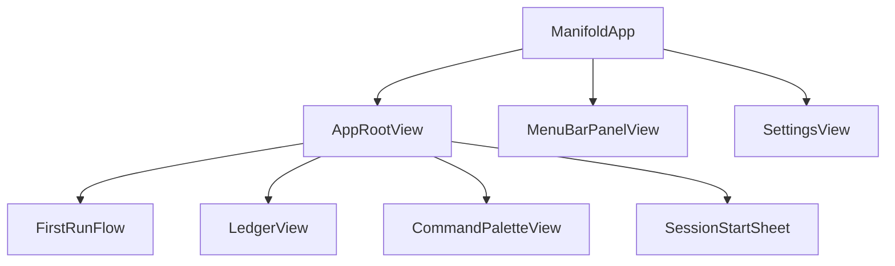
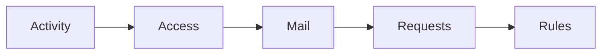
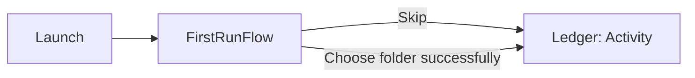
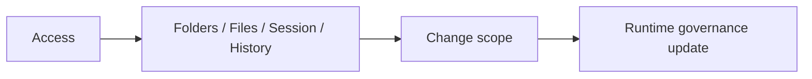
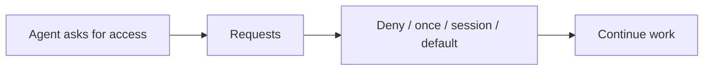
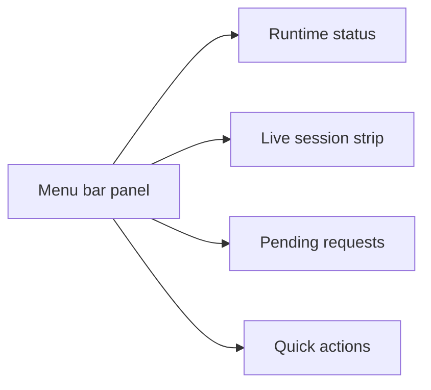

# Manifold Experience Plan

**What this is:** A research-informed, code-grounded plan for onboarding, habit formation, and core UX flows in the rebuilt ledger UI.

**Grounded in:** The current SwiftUI app shell (`AppRootView`, `LedgerView`, `FirstRunFlow`, `MenuBarPanelView`), the local runtime model, and the current UI test suite (`ManifoldAppUITests.swift`).

**Quality bar:** Calm, native, trustworthy, fast, and hard to misunderstand.

---

## Part 1: The Problem Stated Honestly

Manifold asks users to trust it with something they already have a system for, even if that system is just "git + hope." The product still has to clear three barriers:

**Barrier 1: Comprehension** — "What does this actually do?"
Most developers hear "AI agent access control" and think firewall, permissions dialog, or enterprise governance. Manifold is more concrete than that: it decides what agents can access, records what they actually saw, and preserves activity.

**Barrier 2: Configuration** — "Is this worth setting up?"
Connecting MCP, selecting folders, understanding sessions, and learning the ledger model are real costs. The product should keep those costs visible and honest rather than hiding them behind marketing copy.

**Barrier 3: Habit** — "Why would I keep using this?"
Manifold only delivers value when work routes through it. If checking activity, requests, and session state feels like chores, the tool fades from daily use.

The product direction should keep attacking those barriers in order: understand it, trust it, then build a habit around it.

---

## Part 2: The Current Product Direction

The rebuilt UI has established a clearer product shape:

- the main window is a ledger, not a generic tab app
- the menu bar panel is the ambient "is it working?" surface
- onboarding is a lightweight primer, not a mandatory wizard
- empty states and status bars carry a lot of the explanatory load after first run

That direction is good. The plan below assumes we keep it.

### The current shell

### The current ledger model

Each destination answers one concrete question:

- `Activity`: what happened?
- `Access`: what is shared right now?
- `Mail`: what governed mail data exists?
- `Requests`: what needs my answer?
- `Rules`: what is always true?

That is a stronger mental model than the older `Overview / Files / Emails` split.

---

## Part 3: Onboarding Philosophy

### Decision

For the current product stage, onboarding should stay **lightweight, honest, and skippable**.

That means:

- it should explain the product in under a minute
- it should offer one immediate success path: add the first folder
- it should never imply setup succeeded when the user cancelled or backed out
- it should not block entry behind mandatory connection or email configuration

The rebuilt app already leans this way, and the tests already assume it. The docs and design plan should do the same.

### The current flow

`FirstRunFlow.swift` is a three-panel primer:

| Panel | Purpose | Why it exists |
|---|---|---|
| Concept | Explain that Manifold is the trust layer for Claude and Codex | Establish the mental model before details |
| Defaults | Reinforce that nothing is shared by default | Lower anxiety and set the safety baseline |
| Guided add | Offer one fast path to share the first folder | Give the user a concrete next step |

The flow has one global `Skip setup` action. That is intentional.

### Why skippable is the right tradeoff right now

1. The ledger itself is now legible.
The main window no longer depends on a giant setup wizard to make sense. Empty states, sidebar labels, and the status bar do real explanatory work.

2. The product still has multiple setup paths.
Some users will start by sharing a folder. Others will want to connect agents first. Others will inspect the ledger and only configure things later. Forcing one path too early creates friction without enough payoff yet.

3. Truth matters more than completion theater.
Optional onboarding is only a problem when skipping leaves the user in a confusing or broken state. The fix is not necessarily "remove skip"; it is "make the post-skip state honest and understandable."

### Guardrails for the current flow

The current first-run path should follow these rules:

1. Skipping is allowed.
2. Cancelling folder selection does not count as success.
3. Completing folder selection does count as success.
4. After skip, the ledger must clearly explain what is still missing.
5. Deep integration setup belongs in `Access`, `Mail`, `Settings`, and connection help sheets, not in first run.

### Immediate implications

- Keep `FirstRunFlow.swift` as the first-run shell.
- Keep `ManifoldAppUITests.swift` expecting that users can skip into the ledger.
- Keep email setup out of first run.
- Make sure all success states are tied to real outcomes, not button taps.

---

## Part 4: What The Experience Should Optimize For

### 1. Fast comprehension

The product has to answer four user questions quickly:

1. What can the agent see?
2. What actually happened?
3. What needs my decision?
4. Can I recover if something went wrong?

The rebuilt ledger maps well to those questions:

- `Access` answers question 1
- `Activity` answers question 2
- `Requests` answers question 3
- `Activity`, `Access`, and activity/restore flows answer question 4

### 2. Calm status communication

`MenuBarPanelView` and `StatusBar.swift` are the model here:

- healthy states stay quiet
- pending requests become visible without panic
- runtime failures are stated plainly
- active tracked sessions feel important without becoming noisy

This should remain the tone across the app.

### 3. Evidence-first habit loops

The habit loop for Manifold should not be "open the app and click around."
It should be:

1. notice a status change
2. glance at activity or requests
3. answer or confirm something
4. trust that the activity is there next time too

That is why the ledger destinations, menu bar panel, and command palette matter more than splashy tours.

---

## Part 5: Core Flows To Keep Tight

### Flow 1: First run to ledger

Success criteria:

- the user understands the app
- the user can enter the ledger immediately
- the user is never told setup succeeded when it did not

### Flow 2: Shared access

Success criteria:

- scope changes feel deliberate
- current sharing is easy to audit
- empty states remain useful when nothing is shared yet

### Flow 3: Pending requests

Success criteria:

- requests are visible without hijacking the app
- answers are quick to apply
- recent answers help the user build trust in the system's memory

### Flow 4: Ambient trust

Success criteria:

- most days, the menu bar is enough
- the main window is there when the user wants depth
- state changes feel calm, not chatty

---

## Part 6: Truthfulness Rules

These rules should remain non-negotiable:

1. If the runtime is disconnected, say so plainly.
2. If no folders are shared, say so plainly.
3. If no mailboxes are connected, say so plainly.
4. If a user skipped setup, keep the ledger usable and keep the missing steps visible.
5. If a request is pending, show it in `Requests` and in ambient status where appropriate.
6. If coverage has limits, surface those limits instead of overstating control.

This is the core tone of a trust product.

---

## Part 7: Implementation Backlog

Ordered by impact on experience coherence:

### Tier 1: Immediate alignment

| # | What | Why | Files Affected |
|---|---|---|---|
| 1 | Keep docs aligned with the ledger shell | Public docs should match the app users actually open | `docs/ui-map.md`, `docs/architecture.md` |
| 2 | Keep onboarding success tied to real outcomes | Cancelling the folder picker must not silently complete setup | `FirstRunPanels.swift`, `ManifoldStore.swift` |
| 3 | Preserve skippable onboarding in tests | Tests should keep guarding the chosen product direction | `ManifoldAppUITests.swift` |
| 4 | Make post-skip empty states more explicit | Skipping is fine only if the next steps remain obvious | `ActivityWindowView.swift`, `AccessWindowView.swift`, `MailWindowView.swift`, `StatusBar.swift` |

### Tier 2: High-value product polish

| # | What | Why | Files Affected |
|---|---|---|---|
| 5 | Expand command palette coverage | The ledger needs a stronger keyboard-first story | `CommandCenter.swift`, `CommandPaletteView.swift` |
| 6 | Add clearer connection guidance from the ledger | Users who skip onboarding still need a fast way to connect agents | `AccessWindowView.swift`, setup sheets, settings panes |
| 7 | Improve request-to-answer feedback loops | Requests are a core part of daily trust, not edge UI | `RequestsWindowView.swift`, `MenuBarPanelView.swift` |
| 8 | Add stronger "first useful state" empty copy | Empty states should point to the next action without sounding like errors | Activity, Access, Mail empty states |

### Tier 3: Future experiments

| # | What | Why | Constraint |
|---|---|---|---|
| 9 | Optional sample session or demo content | Could accelerate comprehension without blocking entry | Must never replace the real ledger or fake connection state |
| 10 | Smarter post-session summaries | Could strengthen the habit loop around review and trust | Should build on real evidence, not decorative analytics |

---

## Part 8: What Not To Do

1. Do not reintroduce a giant mandatory setup wizard unless the ledger stops being self-explanatory.
2. Do not front-load mail setup into first run.
3. Do not fake successful setup after a cancelled action.
4. Do not hide pending requests behind obscure menus or transient sheets.
5. Do not make the app noisy just to appear active.

---

## Appendix: Codebase Verification

This plan matches the current codebase shape:

| Area | Current file(s) |
|---|---|
| First-run primer | `FirstRunFlow.swift`, `FirstRunPanels.swift` |
| Main window shell | `RootWindowContent.swift`, `LedgerWindowView.swift` |
| Sidebar model | `NavSidebar.swift` |
| Ambient surface | `MenuBarPanelView.swift`, `StatusBar.swift` |
| Keyboard command surface | `CommandPaletteView.swift`, `CommandCenter.swift` |
| UI coverage | `ManifoldAppUITests.swift` |

The important product decision captured here is simple:

**For now, Manifold should get users into the real ledger quickly, keep the first-run flow skippable, and make the ledger itself responsible for explaining what still needs setup.**
