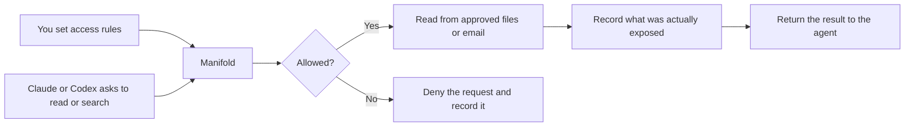
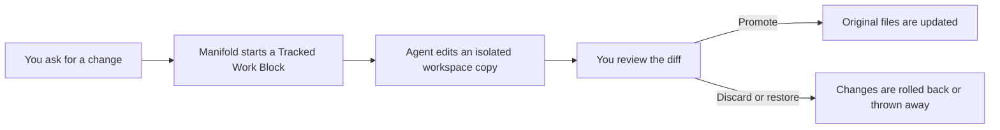
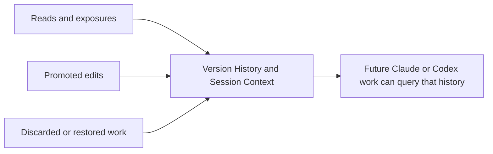

# Manifold — Product Spec

**Version:** 1.0
**Date:** April 13, 2026
**Author:** Amar Gandhi
**Status:** Draft
**License:** Apache 2.0

## What Manifold Is

Manifold is a local macOS app that makes it easy to give Claude and Codex controlled access to the files and emails you choose. You decide what each agent can see, Manifold records what was actually exposed through that access path, and reviewable AI edits happen in a tracked workspace you can inspect, restore, promote, or discard.

Because that history stays on your Mac and persists across sessions, it can become durable context for future AI work.

## The Core Idea

**Per-agent control → recorded exposure → tracked edits → durable context**

In practice, that means:

- You choose which files and emails Claude can access and which Codex can access.
- Manifold records what it actually returned through that access path.
- AI edits happen in a reviewable, restorable workspace.
- That history stays useful across later sessions and across agents.

## How It Works

From your point of view, Manifold works in four simple steps.

### 1. You choose what each agent can see

- You decide which files, folders, and emails are visible to Claude.
- You decide separately what is visible to Codex.
- The same source can be visible to one agent, both agents, or neither.

### 2. Reads and searches go through Manifold

- If the request is allowed, Manifold returns the content and records what was shown.
- If the request is denied, Manifold records that too.

### 3. Edits happen in a tracked workspace

- In V1, reviewable AI edits happen in a tracked workspace, not by directly changing original files through Standing Access.
- This is what makes edits reviewable and restorable.

### 4. The history stays useful later

- The history does not disappear when a session ends.
- Later work can use that local history to understand what changed, what was read, and what other context mattered nearby.

**Boundary note:** Manifold governs the access path routed through Manifold. It does not claim full control over native agent capabilities outside that path. Its job is to enforce clearly where it can and make the boundary visible where it cannot.

## Why It Exists

Claude and Codex are powerful, but they do not give you one local, user-owned system of record for AI work on your Mac. Their access models differ, their logs are vendor-specific, and some activity sits outside the kind of persistent local history a user would want.

Manifold exists to give the user one local place to answer four questions:

1. What can this agent see right now?
2. What was actually shown to it?
3. What changed, and can I undo it?
4. How does this work relate to later sessions?

## Core Product Model

Manifold uses one simple operating model throughout the app.

### Per-Agent Access Policy

Claude and Codex each have their own access policy. A file, folder, email source, domain, or rule can be visible to one agent, both, or neither.

### Standing Access

Standing Access is the default access mode. It is for reading and searching, not direct editing.

- Agents can read and search files and emails that are visible to them through Manifold.
- Standing Access is always audited.
- Standing Access does not grant direct writes to original files.

### Tracked Work Block

A Tracked Work Block is the explicit editing mode for higher-trust work.

- Manifold prepares an isolated, materialized workspace for the approved scope.
- Manifold captures baseline snapshots before edits matter.
- The user can review, restore, promote, or discard changes.
- Promotion back to originals uses conflict-aware comparison rather than silent overwrite.
- In V1, tracked workspaces are the core write path for reviewable AI edits.

### Coverage States

Coverage should be visible in the product instead of implied.

- **Manifold-Routed.** Reads and searches go through Manifold and are governed, recorded, and returned through that path.
- **Tracked Workspace.** Edits happen inside a Tracked Work Block and can be snapshotted, reviewed, restored, promoted, or discarded.
- **Outside Coverage.** Native agent activity outside the Manifold path is not fully governed by Manifold. The app should show that gap clearly and surface any later drift it can detect.

### History Layer

History is one of the core product pillars, not a side effect.

- **Access Decision** means what an agent asked for, whether it was allowed or denied, and why.
- **Exposure Record** means what content was actually returned through Manifold, not just what resource name was requested.
- **Version History** means the per-file timeline of tracked changes and restores.
- **Session Context** means the nearby files, emails, and events that help explain what a change was part of.

Manifold helps agents understand prior work through user-owned history. It does not claim to reconstruct full reasoning state.

## What You Control

- File visibility by agent.
- Email visibility by agent.
- Sensitivity rules and filters for email access.
- Whether access recording stays lightweight or requires richer intent summaries.
- When to start, review, promote, restore, or discard a Tracked Work Block.

## What You See

Manifold is designed to answer two questions clearly: what can this AI see right now, and what did it do with that access?

### App Surfaces

- **Overview.** Current per-agent access, connection state, coverage state, pauses, and active tracked work.
- **Files.** Managed sources, per-agent visibility, file browsing, and Version History.
- **Emails.** Synced email archive, visibility rules, and sensitivity controls.
- **Activity / Versions.** Access history, Exposure Records, tracked changes, restores, drift alerts, and session timelines.
- **Menu Bar.** Fast status, pause controls, coverage visibility, and quick access to active review or approval state.

### What You Can Inspect

- Current visible scope for Claude and Codex.
- Coverage state for the current session or work block, shown with simple labels such as Manifold-Routed, Tracked Workspace, or Outside Coverage.
- Recent activity and denied requests.
- Version History for tracked files.
- Active or recent Tracked Work Blocks.
- Drift or bypass signals when originals changed outside the tracked workflow.
- Session Context around a change, read, or exposure.

## How Claude Desktop and Codex Fit

Claude Desktop and the Codex app are both local desktop agents, but they expose local capability differently.

- **Claude Desktop and Claude Cowork.** Claude Desktop can gain local capability through desktop extensions running on the Mac, and remote capability through Anthropic-hosted connectors. Claude Cowork can run code and commands in a VM on the user's computer, and computer use can act on the real desktop outside that VM with per-app permissions.
- **Codex app.** Codex works from the current project or a managed worktree. Its sandbox and approval settings constrain what it can read, edit, and run.
- **What Manifold adds.** Manifold does not replace those native models. In V1, it adds one shared, user-owned path through MCP plus a local runtime, approval flow, tracked workspace model, and history layer behind that path.

MCP is the first Manifold adapter because it is the lowest-friction shared path across Claude Desktop/Cowork and the Codex app. It is not the whole product.

## What Manifold Records

Manifold records both control decisions and the meaningful outcomes of access.

- **Access Decisions.** Allowed or denied, with reason and policy context.
- **Exposure Records.** The content returned through Manifold, including reads, snippets, previews, diffs, and similar exposures.
- **Tracked writes and snapshots.** Baselines, modifications, restores, and promotion outcomes for tracked file work.
- **Drift and bypass signals.** When originals change outside a tracked workflow, Manifold can record and surface that mismatch as a coverage event.
- **Session Context.** The surrounding files, emails, and audit events that help explain how a change happened.

All of this data is stored locally on the user's machine.

## What Manifold Does Not Do

Manifold has an honest boundary.

- Manifold governs access routed through Manifold.
- It does not claim full OS-level control over native vendor capabilities outside that path, including direct filesystem access, cloud-brokered connectors, plugins, or desktop computer-use actions.
- Drift detection is visibility, not total enforcement.
- It does not replace Claude or Codex.
- It is not a cloud sync service or vendor-hosted compliance backend.

## Design Principles

1. **The user owns the record.** The system of record should belong to the person using the machine, not the vendor.
2. **Standing Access is for read/search.** Tracked Work Blocks are for edit, review, and restore.
3. **Record what was exposed, not just what was requested.** The important audit trail is about delivered content.
4. **Show coverage clearly.** The UI should make it obvious what Manifold governs and what sits outside its path.
5. **Keep the boundary honest.** Manifold should be explicit about what it enforces and what it only surfaces.
6. **Stay local and user-owned.** History, policy, and audit data should stay on the user's Mac.
7. **Trust verified local identity, not just declared labels.** Local callers should be bound to the runtime through the host connection and verified app identity where supported.

## Technical Foundation

Manifold is a native macOS app built around a local runtime and an agent-facing adapter layer, with MCP as the V1 path.

- **Platform:** macOS, Swift 6, SwiftUI
- **Runtime shape:** a local runtime plus a bundled helper executable registered as a LaunchAgent
- **IPC:** XPC between the app surface and the runtime
- **Agent path in V1:** local MCP integration for Claude Desktop/Cowork and Codex
- **Local identity:** XPC connections should be tied to verified local caller identity and code-signing requirements where supported
- **Storage:** SQLite for metadata and audit records, content-addressed blobs for tracked file history
- **Email archive:** local read-only email storage and indexing
- **Write model:** reviewable writes happen through tracked workspaces
- **Drift model:** drift detection supplements the write model without claiming total control

## Reference Documents

These documents define more detailed behavior and implementation direction:

- `design/README.md`
- `design/UI-BACKEND-GAP-AUDIT.md`
- `design/DESIGN-STANDARDS.md`
- `design/APPLE-DESIGN-EXCELLENCE-GUIDE.md`
- `design/RUNTIME-MIGRATION.md`
- `design/RUNTIME-ARCHITECTURE-PLAN.md`
- `design/MENU-BAR-SPEC.md`
- `design/EMAIL-CONTROLS-SPEC.md`
- `design/APP-QUALITY-ROADMAP.md`
- `design/WHY-RUNTIME.md`

Historical design and implementation material from before this April 13, 2026 spec is archived under `design/archive/pre-2026-04-13/`.
