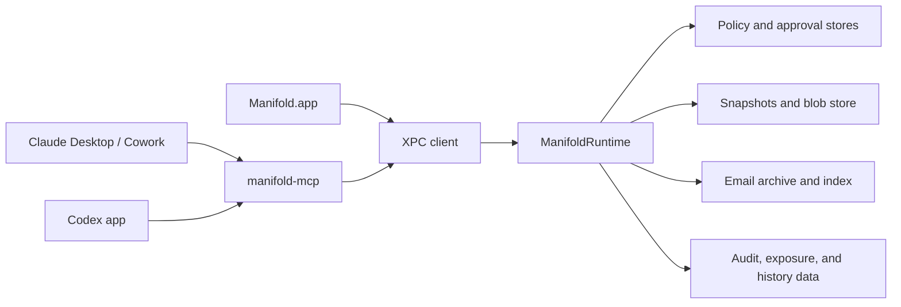

# Architecture

Manifold is the user-owned control plane that sits beside Claude and Codex, recording what they actually saw and changed on your Mac, across sessions and across vendors.

At a high level, Manifold is a native macOS app, a local runtime, and a thin MCP bridge.

## The Layers

### Manifold.app

The SwiftUI app is the user-facing control surface. It shows current access, tracked work, version history, email rules, and coverage state.

Relevant code:

- [../ManifoldApp/ManifoldApp/Models/ManifoldStore.swift](../ManifoldApp/ManifoldApp/Models/ManifoldStore.swift)
- [../ManifoldApp/ManifoldApp/Views/MainView.swift](../ManifoldApp/ManifoldApp/Views/MainView.swift)

### manifold-mcp

`manifold-mcp` is the V1 adapter that Claude Desktop and Codex use to talk to Manifold. It stays thin and forwards requests into the runtime instead of duplicating policy logic.

Relevant code:

- [../Sources/ManifoldMCP/ManifoldMCPServer.swift](../Sources/ManifoldMCP/ManifoldMCPServer.swift)
- [../Sources/ManifoldMCP/ToolDefinitions.swift](../Sources/ManifoldMCP/ToolDefinitions.swift)

### XPC layer

The app and the MCP server both talk to the runtime over XPC. This is the local trust and IPC boundary for governed access.

Relevant code:

- [../Sources/ManifoldXPC/ManifoldXPCClient.swift](../Sources/ManifoldXPC/ManifoldXPCClient.swift)
- [../Sources/ManifoldXPC/ManifoldXPCService.swift](../Sources/ManifoldXPC/ManifoldXPCService.swift)
- [../Sources/ManifoldXPC/ClientIdentityVerifier.swift](../Sources/ManifoldXPC/ClientIdentityVerifier.swift)

### ManifoldRuntime

`ManifoldRuntime` is the source of truth. It owns policy evaluation, tracked work blocks, audit and exposure recording, history/context queries, and drift visibility.

Relevant code:

- [../Sources/ManifoldRuntime/ManifoldRuntime.swift](../Sources/ManifoldRuntime/ManifoldRuntime.swift)
- [../Sources/ManifoldRuntime/ManifoldBridge.swift](../Sources/ManifoldRuntime/ManifoldBridge.swift)

### Stores

The runtime persists the product model in local stores:

- SQLite for policy, audit, exposure, and indexes
- content-addressed blobs for tracked file history
- snapshot timelines for restores and promotions
- local email archive and indexing for governed email access

Relevant code:

- [../Sources/ManifoldKit/GrantStore.swift](../Sources/ManifoldKit/GrantStore.swift)
- [../Sources/ManifoldKit/SnapshotStore.swift](../Sources/ManifoldKit/SnapshotStore.swift)
- [../Sources/ManifoldKit/ExposureStore.swift](../Sources/ManifoldKit/ExposureStore.swift)
- [../Sources/ManifoldKit/ContentStore.swift](../Sources/ManifoldKit/ContentStore.swift)
- [../Sources/ManifoldKit/EmailRuleStore.swift](../Sources/ManifoldKit/EmailRuleStore.swift)

## The Product Model

Manifold follows one operating model throughout the codebase:

- `Standing Access` is for read and search.
- `Tracked Work Blocks` are for edits.
- `History` is durable and reusable across sessions and across agents.

## Coverage Model

Manifold is explicit about what it governs:

- `Manifold-Routed`: reads and searches that go through Manifold
- `Tracked Workspace`: edits inside a tracked workspace
- `Outside Coverage`: native activity outside the governed path

That honesty matters because Claude Desktop / Cowork and Codex do not expose local capability in the same way.

## Deeper References

- [../ARCHITECTURE.md](../ARCHITECTURE.md) for the full architecture write-up
- [../design/PRODUCT-SPEC.md](../design/PRODUCT-SPEC.md) for the canonical product model
- [design-decisions.md](design-decisions.md) for the rationale behind the current shape
