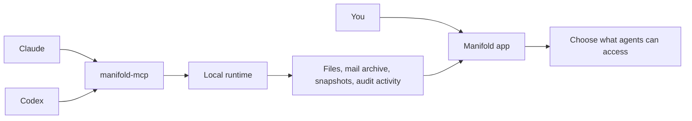
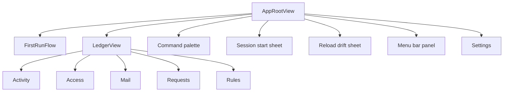
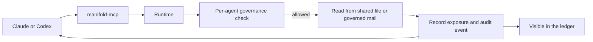
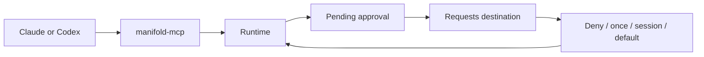
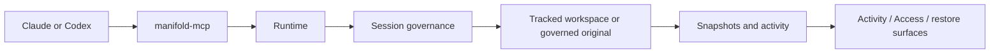
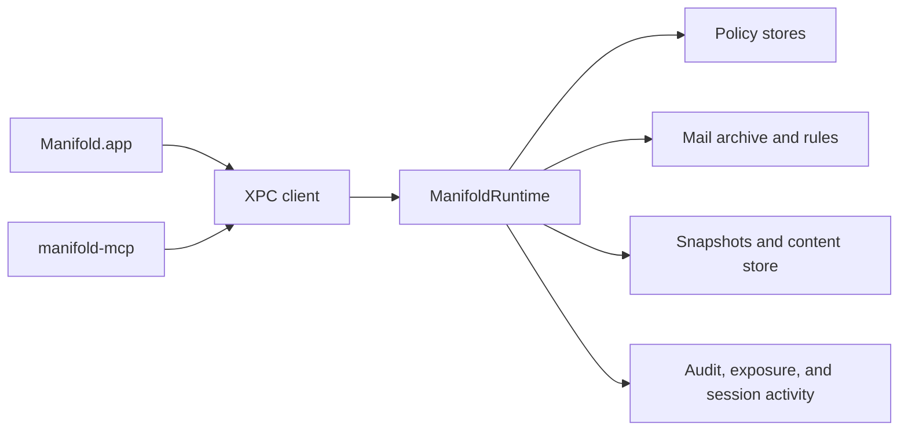
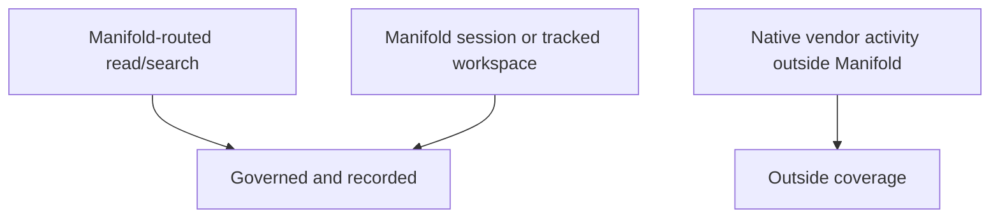

# Architecture

Manifold is the user-owned control plane that sits beside Claude and Codex, recording what they actually saw and changed on your Mac when their work flows through Manifold.

This page explains the app the way a user experiences it first, then shows the local runtime behind it.

## The Short Version

The app does three jobs:

- it shows what Claude and Codex can access right now
- it records what an agent actually read or changed through Manifold
- it gives you a governed session model, activity, and restore path for tracked work

## What The User Sees

The user-facing app is now a small set of clear surfaces rather than a tab-heavy shell.

### First run

The first-run flow is a short primer, not a mandatory setup wizard.

It does three things:

1. explains what Manifold is
2. reminds the user that nothing is shared by default
3. offers one quick way to add the first governed folder

The flow is intentionally skippable. If the user skips it, they land in the ledger immediately and the empty states and status bar tell them what still needs configuration.

Relevant code:

- [../ManifoldApp/ManifoldApp/Views/FirstRun/FirstRunFlow.swift](../ManifoldApp/ManifoldApp/Views/FirstRun/FirstRunFlow.swift)
- [../ManifoldApp/ManifoldApp/Views/FirstRun/FirstRunPanels.swift](../ManifoldApp/ManifoldApp/Views/FirstRun/FirstRunPanels.swift)
- [../ManifoldApp/ManifoldApp/Views/RootWindowContent.swift](../ManifoldApp/ManifoldApp/Views/RootWindowContent.swift)

### Ledger window

`LedgerView` is the main window shell. It is a `NavigationSplitView` with five destinations:

- `Activity`: the evidence ledger for sessions and events
- `Access`: governed folders, files, session deltas, and access activity
- `Mail`: governed mailboxes, threads, and mail-session evidence
- `Requests`: pending approvals plus recent answers, with the current queue focused on standing-write prompts
- `Rules`: preview-only global governance authoring

The main window also keeps two pieces of state visible all the time:

- the toolbar for session creation and refresh actions
- the bottom status bar for honest runtime and session state

Relevant code:

- [../ManifoldApp/ManifoldApp/Views/LedgerWindowView.swift](../ManifoldApp/ManifoldApp/Views/LedgerWindowView.swift)
- [../ManifoldApp/ManifoldApp/Views/Chrome/NavSidebar.swift](../ManifoldApp/ManifoldApp/Views/Chrome/NavSidebar.swift)
- [../ManifoldApp/ManifoldApp/Views/Chrome/IntegratedToolbar.swift](../ManifoldApp/ManifoldApp/Views/Chrome/IntegratedToolbar.swift)
- [../ManifoldApp/ManifoldApp/Views/Chrome/StatusBar.swift](../ManifoldApp/ManifoldApp/Views/Chrome/StatusBar.swift)

### Supporting surfaces

The app uses a few focused supporting surfaces instead of deep nested flows:

- `CommandPaletteView` for keyboard-first actions
- `SessionStartSheet` for starting a new session
- `ReloadDriftSheet` for turning a historical context back into a new session draft
- `MenuBarPanelView` for ambient status, requests, and quick actions
- `SettingsView` for general setup, agent configuration, storage, mail, and advanced options

## The Three Flows That Matter

### 1. Governed read or search

This is the normal read path.

What this means in plain English:

- the agent asks through Manifold
- Manifold checks whether that agent is allowed to see the file or mail content
- if allowed, Manifold returns the content
- Manifold records what was actually shown

### 2. Requests and approvals

When the agent wants something outside current scope, it does not silently widen access. It creates a request for the user.

This is why `Requests` exists as a first-class destination: approvals are part of normal use, not an exceptional hidden sheet.

### 3. Sessions, tracked work, and restore

What this means in plain English:

- sessions determine what the agent can do right now
- tracked work can be snapshotted and reviewed
- activity and restore are part of the same local evidence trail

## The Runtime Behind The UI

Once you look behind the app, the system is still fairly simple.

### Manifold.app

The SwiftUI app is the local control surface. It is where the user reviews access, sees evidence, answers requests, and starts new sessions.

### manifold-mcp

`manifold-mcp` is the adapter Claude and Codex use to talk to Manifold.

### XPC

XPC is the local IPC boundary between the app, the MCP bridge, and the runtime.

### ManifoldRuntime

`ManifoldRuntime` is the source of truth for governance, sessions, activity, coverage state, and restore data.

### Stores

The runtime persists:

- governance and audit data in SQLite
- file activity in snapshots and content-addressed blobs
- governed mail metadata in the local archive and rule stores

## What Manifold Actually Governs

Manifold is intentionally honest about coverage.

So the simple rule is:

- if the work goes through Manifold, Manifold can govern and record it
- if the work happens outside Manifold, the app should surface that boundary instead of pretending it controls everything

## If You Want More Depth

- [../README.md](../README.md) for the fast project overview
- [ui-map.md](ui-map.md) for the current window and surface map
- [mcp-integration.md](mcp-integration.md) for Claude/Codex wiring
- [design-decisions.md](design-decisions.md) for why the system is shaped this way
- [../design/PRODUCT-SPEC.md](../design/PRODUCT-SPEC.md) for the canonical product definition
