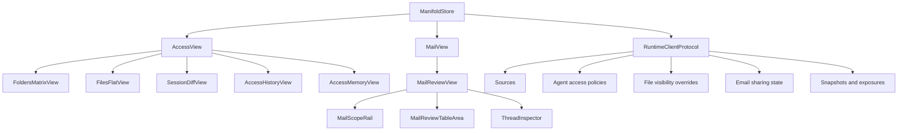
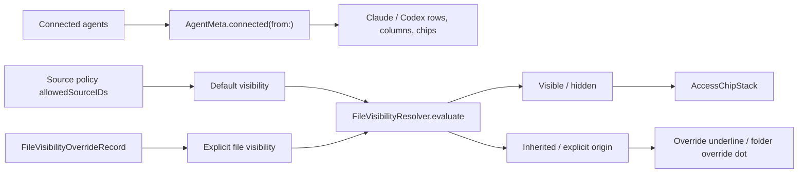
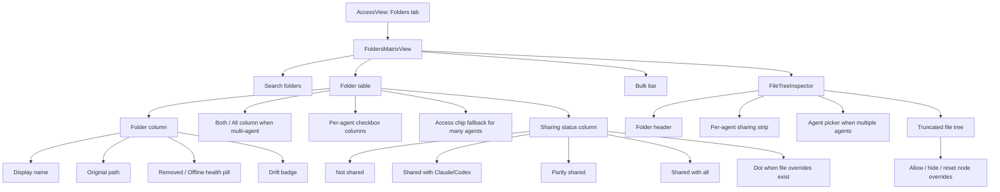
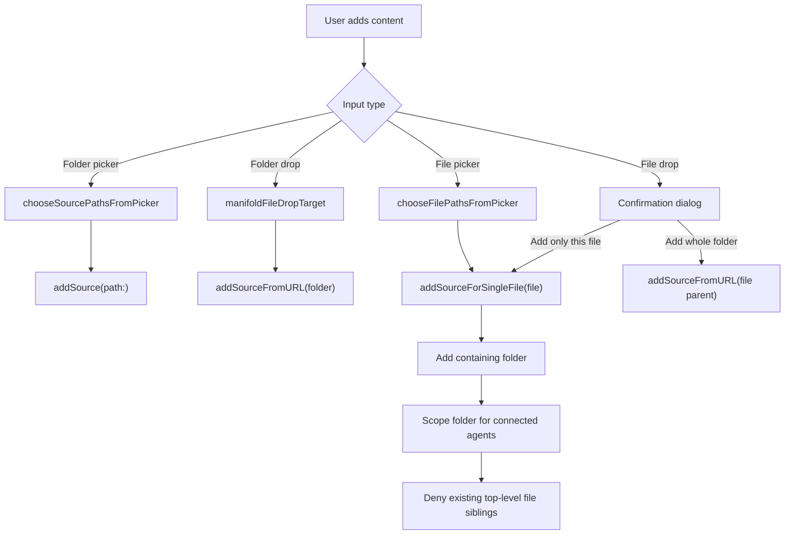
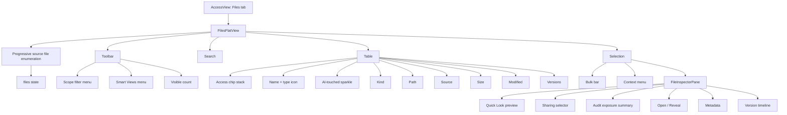
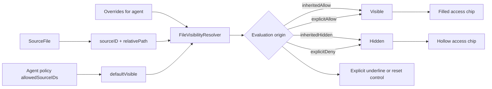
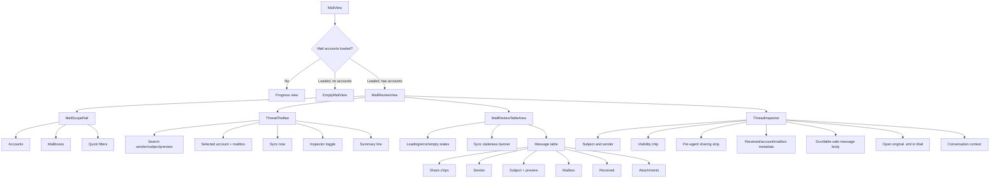
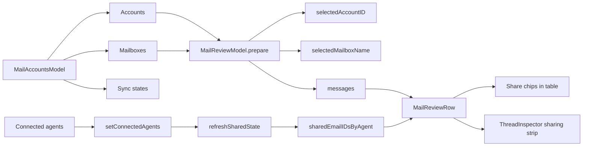
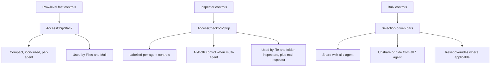

# Files, Folders, and Email Feature Map

This document maps the current SwiftUI implementation for Manifold's file,
folder, and email governance surfaces.

## Domain Overview

At a high level:

- **Folders** control default source scope per AI.
- **Files** control explicit per-file allow or deny overrides inside those sources.
- **Email** controls per-message visibility inside backed-up mail.
- **Agents** are rendered through shared metadata and controls: `AgentMeta`, `AccessChipStack`, and `AccessCheckboxStrip`.

## Shared Access Model

Visibility is layered:

| Layer | Scope | Meaning |
|---|---|---|
| Source policy | Folder/source | The folder is shared with an agent by default. |
| File override | File or subfolder | A specific file path is explicitly allowed or denied. |
| Resolver result | Effective file state | Combines the source default with overrides. |
| Origin | UI explanation | Indicates whether state is inherited or explicit. |

## Folders

Folder features:

- Add folders from the toolbar, empty state, Finder request file, or drag and drop.
- Toggle folder default access per connected AI.
- Toggle all agents through the `Both`/`All` control.
- Search and sort folder rows.
- Multi-select folders for bulk share, bulk unshare, or remove.
- Show sharing state in plain English rather than relying only on color.
- Show source health inline with the folder name.
- Show drift counts for files changed since an agent's last session.
- Inspect files inside a selected folder and write file-level overrides.
- Surface explicit file overrides back to the folder row with a small dot.
- Mark deeper tree levels as truncated with “More items not shown”; the Files tab is the full-depth management surface.

## Folder Add and Drop Flow

Single-file adds are folder-backed because the runtime tracks sources at folder
granularity. The UI preserves user intent by adding explicit deny overrides for
existing sibling files when the user chooses a single file.

## Files

File features:

- Enumerate files progressively across active, accessible sources.
- Filter by all, shared, unshared, shared with a specific agent, allowed overrides, hidden overrides, changed, and AI-touched.
- Save and recall Smart Views as stored combinations of scope filter and search text.
- Search by file name, relative path, or source name.
- Sort by table columns.
- Toggle access inline per agent via `AccessChipStack`.
- Show explicit override status through effective visibility calculation.
- Mark AI-touched files with a sparkle indicator.
- Open files with the default app through primary action, context menu, or inspector.
- Quick Look selected files.
- Reveal selected files in Finder.
- Copy file paths.
- Bulk share, bulk unshare, or reset overrides across selected files.
- Inspect one file with preview, sharing controls, audit summary, metadata, and versions.
- Inspect many files with an aggregate selection summary.

## File Visibility Flow

## Email

Email features:

- Load backed-up mail accounts before rendering the review surface.
- Show an empty mail state when no accounts are configured.
- Browse backed-up mail by account and mailbox.
- Apply quick filters.
- Search sender, subject, or preview text with debounced reload.
- Sync the selected account.
- Show stale or paused backup state.
- Sort message rows.
- Toggle per-message sharing per connected AI.
- Use the same `AccessChipStack` pattern as file rows.
- Open the inspector by selecting/double-clicking a message or using the toolbar toggle.
- Show a scrollable message excerpt, falling back to preview text when body extraction is unavailable.
- Keep readable `.eml` creation behind explicit export.
- Show conversation context and per-message visibility.

## Email State Flow

Email sharing is per message. A thread is displayed as conversation context, but
the current review table and inspector operate on individual `emailID` values
when sharing or hiding.

## Cross-Surface Controls

## Feature Matrix

| Capability | Folders | Files | Email |
|---|---:|---:|---:|
| Add from picker | Yes | Yes, as single-file scoped parent source | No, mail setup path only |
| Drag/drop add | Yes | Yes, through shared drop target | Not implemented in current SwiftUI surface |
| Search | Folder name/path | File name/path/source | Sender/subject/preview |
| Sort | Table columns | Table columns | Table columns |
| Per-agent row toggle | Yes | Yes | Yes |
| All/Both toggle | Yes | Bulk/inspector | Inspector/context actions |
| Bulk actions | Share/unshare/remove | Share/hide/reset | Context actions, not bulk bar |
| Explicit overrides | File overrides flagged at folder level | File allow/deny overrides | Message shared/unshared state |
| Inspector | File tree | File preview/audit/versions | Message metadata/body/context |
| Smart Views | Not implemented | Implemented | Not implemented |
| AI-touched indicator | Drift badge by source | Sparkle/filter | Not implemented |
| Open externally | Reveal/copy from tree context | Open, Quick Look, Reveal | Open original `.eml` |

## Primary Code Map

| Area | Primary files |
|---|---|
| Access shell | `ManifoldApp/ManifoldApp/Views/Access/AccessWindowView.swift` |
| Folder matrix | `ManifoldApp/ManifoldApp/Views/Access/FoldersMatrixView.swift` |
| Folder inspector | `ManifoldApp/ManifoldApp/Views/Access/FileTreeInspector.swift` |
| File list | `ManifoldApp/ManifoldApp/Views/Access/FilesFlatView.swift` |
| File inspector | `ManifoldApp/ManifoldApp/Views/Access/FileInspectorPane.swift` |
| Drop target | `ManifoldApp/ManifoldApp/Components/Primitives/FileDropTarget.swift` |
| Shared access controls | `ManifoldApp/ManifoldApp/Components/Primitives/AccessChipStack.swift` |
| Store methods | `ManifoldApp/ManifoldApp/Models/ManifoldStore.swift` |
| Mail shell | `ManifoldApp/ManifoldApp/Views/Mail/MailWindowView.swift` |
| Mail review | `ManifoldApp/ManifoldApp/Views/Mail/ThreadsView.swift` |
| Mail state | `ManifoldApp/ManifoldApp/Models/EmailSelectionModel.swift` |
