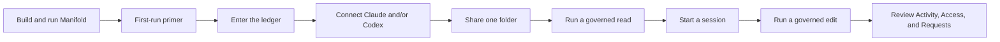
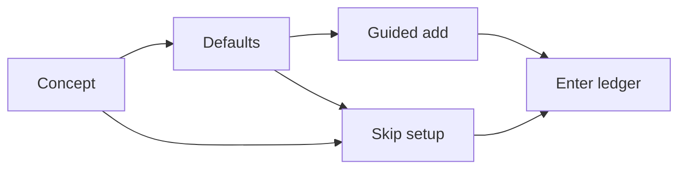
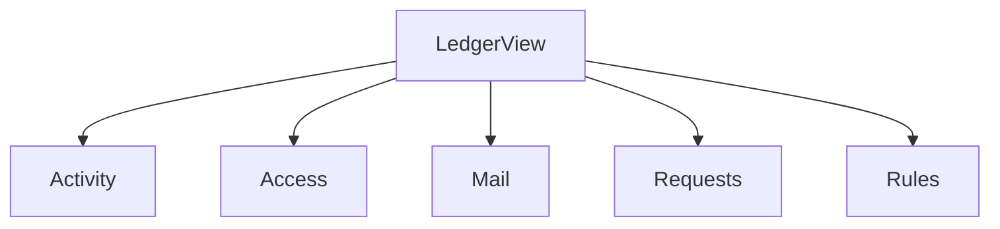
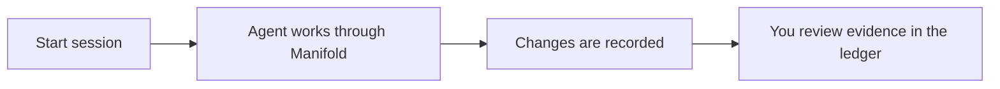

# Getting Started

Manifold is the user-owned control plane that sits beside Claude and Codex, recording what they actually saw and changed on your Mac when their work goes through Manifold.

This guide is the shortest real path through the current app: build it, enter the ledger, connect an agent, share one small folder, and run one governed read plus one governed session.

## Before You Start

- macOS 26.0 or later
- Xcode 26.0 or later
- Swift 6
- a local signing team in Xcode for running the app target
- Claude Desktop, Codex, or both if you want live agent testing

## The Basic Flow



## 1. Build And Run The App

```bash
git clone <repo-url>
cd Manifold
swift build
swift test
open Manifold.xcodeproj
```

In Xcode:

1. Select the `Manifold` scheme.
2. Choose your signing team.
3. Update the bundle identifier if needed.
4. Run the app.

If you want a shell-first app build check:

```bash
xcodebuild -project Manifold.xcodeproj \
  -scheme Manifold \
  -configuration Debug \
  build \
  CODE_SIGNING_ALLOWED=NO
```

## 2. Go Through The First-Run Primer

The first-run flow is now a short, skippable "protect my next AI session" primer.



What each panel does:

- `Concept`: explains that Manifold governs what Claude and Codex can see through Manifold
- `Defaults`: reinforces that nothing is shared until you share it
- `Guided add`: gives you one fast path to add the first governed folder

Important behavior:

- `Skip setup` is allowed
- cancelling the folder picker does not count as setup success
- email setup is not part of first run anymore

If you skip, the app drops you into the real ledger immediately. The empty states and status bar then guide the next steps.

## 3. Learn The Main Window

The main window is the ledger. It is not the old `Overview / Files / Emails` shell anymore.



What each destination is for:

- `Activity`: what happened across sessions and events
- `Access`: what files are shared right now, plus file/session activity
- `Mail`: governed mailboxes and mail-session evidence
- `Requests`: pending approvals, especially standing-write prompts for governed files
- `Rules`: preview-only file, email, and agent governance authoring

Supporting surfaces:

- toolbar: start a session or refresh runtime state
- status bar: see whether the runtime and agents are actually connected
- menu bar panel: ambient status and quick actions
- command palette: keyboard-first jump point for common tasks

## 4. Connect Claude And/Or Codex

Agent setup now lives outside first run.

Use one of these paths:

1. Open `Settings` and go to the `Agents` tab.
2. Use the command palette and search for settings.

The `Agents` settings pane shows live checks for:

- whether Claude Desktop or Codex is installed
- whether Manifold has been added to the local MCP config
- whether the connection is currently verifiable

If you need the deeper setup details, use [mcp-integration.md](mcp-integration.md).

## 5. Share A Small Test Folder

For the first live test, keep the scope tiny.

Example:

```text
shared/
claude-only/
codex-only/
```

To add folders:

1. Open `Access`.
2. If nothing is shared yet, click `Add a folder…`.
3. Or use `Shift-Command-O` / `Add Folder…` from the app commands.

Recommended first pass:

1. share `shared/` with the agent you plan to test first
2. keep the rest of your machine outside Manifold
3. add `claude-only/` or `codex-only/` only if you want to test different scopes

The important mental model:

- Manifold does not open your whole Mac to the agent
- you explicitly choose governed folders
- mail is a separate surface from folders
- native activity outside the Manifold path stays outside Manifold's control

## 6. Run One Governed Read

Use a prompt like:

```text
Use the Manifold MCP server only for file access in this task.
List the files I can access and read the marker files that are available.
```

What should happen:

- the agent only sees the folders shared with it through Manifold
- the read is recorded in `Activity`
- if the agent asks for something outside scope, the request lands in `Requests`

What to check in the app:

1. `Activity` for the read events
2. `Access` for the current governed scope
3. `Requests` if anything needed approval

## 7. Start A Session And Run One Governed Edit

Start a session from either:

- the `Start session` toolbar button
- `New Session…` in the app menu

Then use a prompt like:

```text
Use the Manifold MCP server only.
Update shared/worklog.md with one short line saying which agent made this change.
```

What should happen:



The important point is that governed work should be visible and reviewable, not silently hidden.

## 8. Review What Happened

The normal review path in the rebuilt app is:

1. `Activity` to see the event trail
2. `Access` to inspect current sharing and session/file activity
3. `Requests` to answer anything the agent asked for
4. `Rules` if you want to explore future governance authoring; today it is a local preview surface, not the live runtime rule system

The status bar and menu bar panel should also tell you whether the runtime is healthy and whether a session is active.

## 9. Optional: Explore Mail Later

Mail is now a second act, not part of first run.

When you are ready:

1. open `Mail`
2. inspect the mailbox empty state
3. configure mail from the app when that path is relevant to your workflow

If you are just trying to understand the core product, you can ignore mail on day one.

## 10. If You Want To Test Both Apps

For the deeper live-agent workflow, use:

- [../design/CLAUDE-CODEX-TESTING.md](../design/CLAUDE-CODEX-TESTING.md)

That guide is the fuller integration pass. This page is just the shortest path to understanding the current shell and getting one real governed session running.

## Next Docs

- [architecture.md](architecture.md) for the simple system shape
- [ui-map.md](ui-map.md) for the current window and surface map
- [mcp-integration.md](mcp-integration.md) for Claude/Codex setup details
- [design-decisions.md](design-decisions.md) for the rationale behind the runtime and coverage model
- [../design/PRODUCT-SPEC.md](../design/PRODUCT-SPEC.md) for the full product definition
