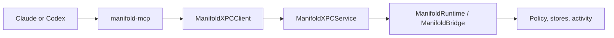

# MCP Integration

Manifold uses MCP as the first shared integration path for Claude Desktop and Codex.

That means:

- Manifold exposes tools through `manifold-mcp`
- Claude Desktop and Codex connect to that server locally
- requests flow through XPC into the runtime
- the runtime applies access governance, records exposure, and manages tracked work

## Why MCP

MCP is the practical vendor-neutral baseline for Manifold today:

- Claude Desktop supports local MCP servers
- Codex supports MCP configuration and local tool use
- the same governed path can back both apps

MCP is the adapter, not the whole product. The runtime remains the source of truth.

## Request Flow



## What `manifold-mcp` Exposes

At a high level, the tool surface covers:

- status and coverage
- governed file listing and reads
- governed email listing, reads, and search
- tracked work and activity/context queries

See:

- [../Sources/ManifoldMCP/ToolDefinitions.swift](../Sources/ManifoldMCP/ToolDefinitions.swift)
- [../Sources/ManifoldMCP/ManifoldMCPServer.swift](../Sources/ManifoldMCP/ManifoldMCPServer.swift)

## Claude Desktop

Claude Desktop uses local MCP configuration. Manifold’s installer writes the `manifold` server entry into Claude’s config so the tools appear inside Claude Desktop.

Relevant code:

- [../Sources/ManifoldKit/ConfigWriter.swift](../Sources/ManifoldKit/ConfigWriter.swift)

Practical testing guide:

- [../design/CLAUDE-CODEX-TESTING.md](../design/CLAUDE-CODEX-TESTING.md)

## Codex

Codex uses its own local MCP config. Manifold writes the matching `manifold` server block for Codex so the governed tools are available there too.

Relevant code:

- [../Sources/ManifoldKit/ConfigWriter.swift](../Sources/ManifoldKit/ConfigWriter.swift)

## Installing The Config

The normal path is through the app’s install or repair flow.

If you need the CLI path:

```bash
swift run manifold-mcp --install
```

That updates the local config files for supported hosts without overwriting unrelated servers.

## Important Boundary

Manifold governs the access path that goes through `manifold-mcp`.

It does not claim full control over native activity outside that path. That is why the app surfaces coverage states and drift signals instead of pretending every vendor capability is fully governed.
