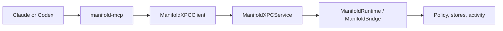

# MCP Integration

Manifold uses MCP as the shared integration path for Claude Desktop, Claude Cowork, Claude Code (CLI), and Codex CLI.

That means:

- Manifold exposes tools through `manifold-mcp`
- All four supported clients connect to that server locally
- requests flow through XPC into the runtime
- the runtime applies access governance, records exposure, and manages tracked work

## Why MCP

MCP is the practical vendor-neutral baseline for Manifold today:

- Claude Desktop, Claude Cowork, and Claude Code all support local MCP servers
- Codex CLI supports MCP configuration and local tool use
- the same governed path can back every client we support

MCP is the adapter, not the whole product. The runtime remains the source of truth.

## Request Flow



## What `manifold-mcp` Exposes

At a high level, the tool surface covers:

- status and coverage
- governed file listing and reads
- governed email listing, reads, and search
- tracked work and activity/context queries
- scoped memory recall, memory notes, memory-source summaries, and scoped memory deletion
- capability handles and sink-flow checks for sensitive values
- strict claimed-action verification against scoped exposure evidence

See:

- [../Sources/ManifoldMCP/ToolDefinitions.swift](../Sources/ManifoldMCP/ToolDefinitions.swift)
- [../Sources/ManifoldMCP/ManifoldMCPServer.swift](../Sources/ManifoldMCP/ManifoldMCPServer.swift)

## Memory, Capability, And Proof Semantics

MCP tools are authority-bearing only when the runtime can tie them back to the current access context.

- `save_memory_note` creates agent-derived memory only when runtime memory settings allow it. Amnesiac mode returns a clear "not saved" response and records a memory-policy ledger event.
- `recall_memory`, `reuse_prior_context`, and `query_graph` expire derived memory before returning context so retention is not a cosmetic UI control.
- `forget_memory` loads the memory item first and only tombstones it when the item belongs to the current grant or every source in its lineage is available in the current scope. Missing and out-of-scope memory IDs receive the same denial.
- `check_capability_flow` loads the value handle first. Grant-backed handles must match the current grant; standing handles must have non-empty source lineage that is a subset of the current scope.
- `verify_claimed_actions` expects structured claims. A claim is `supported` only when a scoped current-connection exposure matches either `content_hash` or the same `tool_name + resource_path`. Text-only, tool-only, resource-only, and loose-overlap claims are `ambiguous`; claims without scoped evidence are `unverified`.

This is intentionally stricter than a convenience audit search. It prevents one agent session from proving, deleting, or querying artifacts that belong to another grant or source set.

## Supported Clients And Where They're Configured

| Client | MCP config file | Rules file (preference nudge) |
|---|---|---|
| Claude Desktop | `~/Library/Application Support/Claude/claude_desktop_config.json` | (uses Projects feature inside the app) |
| Claude Cowork | same as Claude Desktop | same |
| Claude Code (CLI) | `~/.claude/settings.json` | `~/CLAUDE.md` |
| Codex CLI | `~/.codex/config.toml` | `~/.codex/AGENTS.md` |

`manifold-mcp --install` (or the app's install/repair flow) writes all
of these. The MCP entries register the `manifold-mcp` binary so the
client can launch it and call tools. The rules files are
Manifold-managed Markdown blocks that nudge the AI to prefer
`manifold.*` tools over native Read/Edit/Bash for files in approved
sources, so cross-agent memory and the audit ledger actually capture
activity.

The rules block uses HTML-comment delimiters
(`<!-- manifold:rules:begin ... -->` / `<!-- manifold:rules:end -->`)
so re-running install replaces only the Manifold section. User content
above and below is preserved verbatim across re-installs.

Practical testing guide:

- [../design/CLAUDE-CODEX-TESTING.md](../design/CLAUDE-CODEX-TESTING.md)

Relevant code:

- [../Sources/ManifoldKit/ConfigWriter.swift](../Sources/ManifoldKit/ConfigWriter.swift)
- [../Sources/ManifoldKit/AgentRulesTemplate.swift](../Sources/ManifoldKit/AgentRulesTemplate.swift)

## Trust Boundary — What Manifold Does And Doesn't Govern

Manifold governs the access path that goes through `manifold-mcp`.

**Inside the boundary** (governed, audited, scoped per-agent):

- File reads, searches, and writes called via `manifold.read_file`,
  `manifold.write_file`, `manifold.search_files`, `manifold.read_range`,
  `manifold.diff_file`.
- Email reads and search via `manifold.list_emails`,
  `manifold.read_email`, `manifold.search_emails`.
- Cross-agent context and memory via `manifold.reuse_prior_context`,
  `manifold.recall_memory`, `manifold.was_exposed_before`,
  `manifold.what_changed_since`, `manifold.verify_claimed_actions`.
- Capability flow checks (Rule of Two) via `manifold.check_capability_flow`.
- Tracked workspace edits with version history.

**Outside the boundary** (intentionally not governed):

- AI tools' native shell, network, and direct filesystem access.
  Claude Code's `Bash` / `Read` / `Edit` and Codex CLI's native shell
  can bypass Manifold completely. The rules file shipped via
  `--install` nudges the AI to prefer `manifold.*` tools, but nothing
  enforces it.
- Computer use / vision capabilities (e.g., the AI controlling the
  mouse). Outside the process boundary entirely.
- Vendor-hosted connectors and remote tool calls executed on the
  vendor's infrastructure rather than the user's machine.
- AI tools that don't support MCP. No installation point, no
  governance.

The app surfaces coverage states and drift signals so users can see
which path each agent is using, instead of pretending every vendor
capability is fully governed. See `manifold.get_coverage_status` and
the Coverage Events log in the app.

## Installing The Config

The normal path is through the app's install or repair flow.

If you need the CLI path:

```bash
swift run manifold-mcp --install
```

That updates the local config files for all supported hosts and
writes the rules files, without overwriting unrelated MCP servers or
unrelated rules in `~/CLAUDE.md` / `~/.codex/AGENTS.md`.
