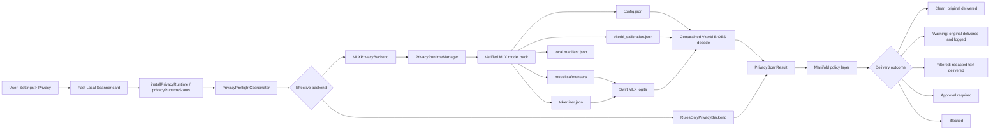
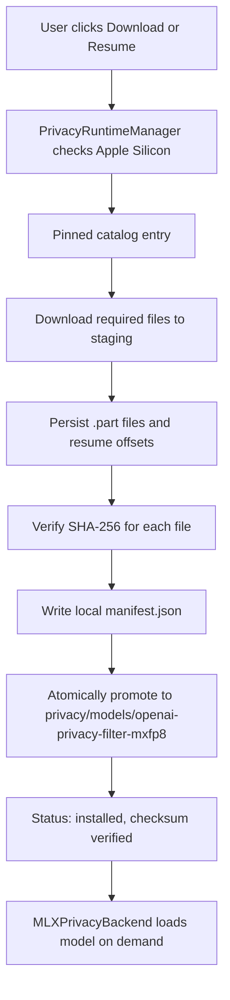
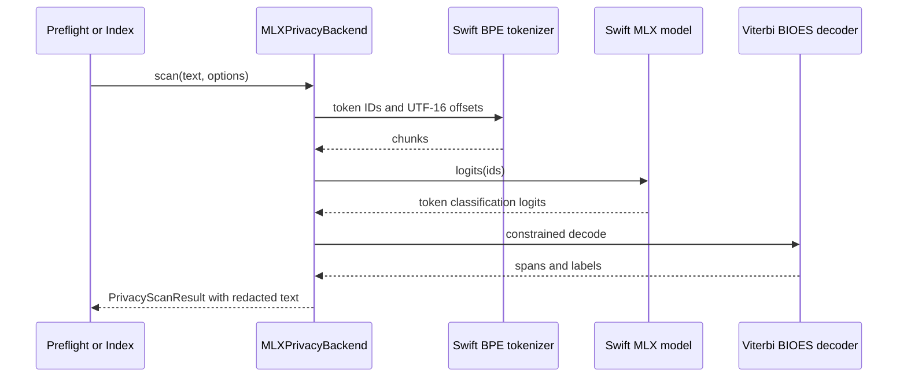
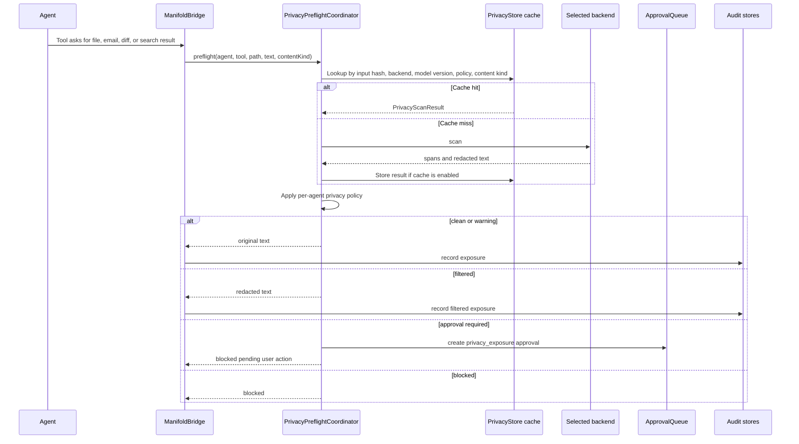
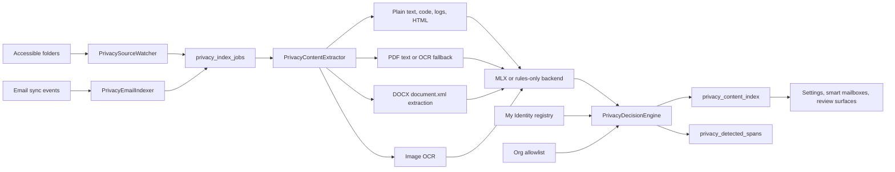

# OpenAI Privacy Filter In Manifold

Date: 2026-04-29

## Short Version

Manifold now treats OpenAI Privacy Filter as a native, app-managed MLX model pack. The user installs the app first, then downloads the optional scanner assets from a pinned Hugging Face snapshot, similar to Xcode downloading simulator runtimes after Xcode itself is installed.

The active model-backed scanner is MLX MXFP8 only:

- Runtime ID: `openai-privacy-filter-mlx-mxfp8`
- Backend kind: `mlx`
- Source: `mlx-community/openai-privacy-filter-mxfp8`
- Install location: `privacy/models/openai-privacy-filter-mxfp8`
- Offline after install: yes
- External user dependencies: none
- Supported hardware: Apple Silicon Macs

Legacy stored backend values `core_ml` and `official_cli` decode to `mlx` so old settings do not crash. They are migration inputs only, not active runtime choices.

## System Map



## Install Lifecycle



Required downloaded files:

| File | Purpose |
| --- | --- |
| `model.safetensors` | MXFP8 quantized weights. |
| `model.safetensors.index.json` | Checkpoint index metadata. |
| `config.json` | Model, labels, RoPE, MoE, and decode configuration. |
| `tokenizer.json` | BPE tokenizer vocabulary and merge graph. |
| `tokenizer_config.json` | Tokenizer special-token metadata. |
| `viterbi_calibration.json` | Decoder transition/start/end calibration. |
| `manifest.json` | Locally generated verified-install manifest. |

The remote repository does not currently ship Manifold's `manifest.json`; Manifold creates it after all pinned files verify successfully.

## Pinned Catalog

The source-controlled catalog pins the Hugging Face snapshot and file hashes before any install starts:

| Field | Value |
| --- | --- |
| Repository | `mlx-community/openai-privacy-filter-mxfp8` |
| Snapshot | `73372cab9eaf32ef2ccaa4e48ddbbcc63fa55a45` |
| Version label | `2026-04-23-73372cab9eaf` |
| Approximate size | `1.47 GB` |

The downloader uses `URLSession`, staging directories, partial files, resume offsets, SHA-256 verification, and atomic promotion. A partial or checksum-failing pack never becomes the installed scanner.

## Native Scanner Flow



The Swift MLX port implements the model architecture directly in the app: quantized MXFP8 linear layers, RMSNorm, YaRN RoPE, bidirectional sliding-window attention, sparse MoE top-k routing, token classification logits, and exact checkpoint-key validation.

## Request-Time Preflight



If MLX is not installed, unavailable, or unsupported on the current Mac, live preflight uses rules-only scanning. On Intel Macs, the Settings UI marks Privacy Preflight unavailable and disables model install/scanning controls.

## Background Privacy Index



The index stores severity, matched categories, identity matches, allowlist matches, redacted preview, scan status, extraction status, and span records. Large text is segmented before scanning.

## UI State

The Settings card is presented as:

```text
Fast Local Scanner
MLX MXFP8 · 1.47 GB · Recommended for Apple Silicon Macs
Download / Resume / Cancel / Remove
```

Runtime status exposes:

| Field | Meaning |
| --- | --- |
| `installState` | `download_required`, `downloading`, `verifying`, `installed`, or `unavailable`. |
| `downloadedBytes` | Bytes downloaded for the current install. |
| `totalBytes` | Total expected bytes from the pinned catalog. |
| `downloadProgress` | Fractional progress from `0.0` to `1.0`. |
| `runtimeID` | `openai-privacy-filter-mlx-mxfp8`. |
| `runtimeDisplayName` | `Fast Local Scanner`. |
| `installedVersion` | Installed pinned snapshot version. |
| `verificationState` | Checksum verification state. |
| `modelLoaded` | Whether the MLX backend has loaded the model in memory. |
| `lastError` | Last install or scan error. |

## Migration

Migration 34 converts stored `core_ml` and `official_cli` selections to `mlx`, resets installed model metadata to `download_required`, and deletes stale model scan-cache rows for old model-backed backends. Startup cleanup also best-effort removes the old managed runtime directory.

## Source Anchors

| Area | Files |
| --- | --- |
| Backend enum and runtime status types | `Sources/ManifoldKit/PrivacyTypes.swift` |
| Migration 34 | `Sources/ManifoldKit/DatabaseMigrator.swift` |
| Model pack manager and catalog | `Sources/ManifoldRuntime/PrivacyRuntimeManager.swift` |
| Native MLX scanner | `Sources/ManifoldRuntime/MLXPrivacyBackend.swift` |
| Preflight wiring | `Sources/ManifoldRuntime/PrivacyPreflightCoordinator.swift` |
| Index wiring | `Sources/ManifoldRuntime/PrivacyIndexCoordinator.swift` |
| XPC commands | `Sources/ManifoldXPC/ManifoldXPCService+AppCommands.swift` |
| Settings UI | `ManifoldApp/ManifoldApp/Views/Settings/PrivacySettingsPane.swift` |
