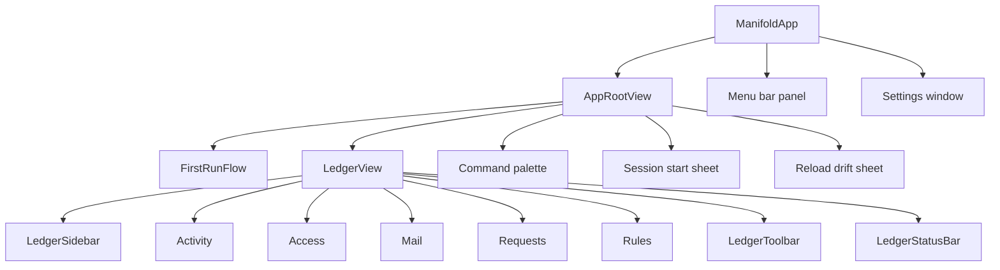
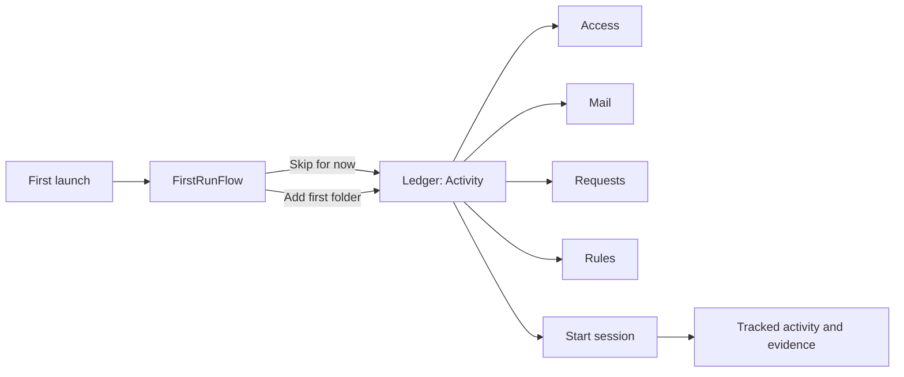
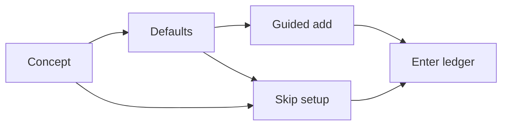
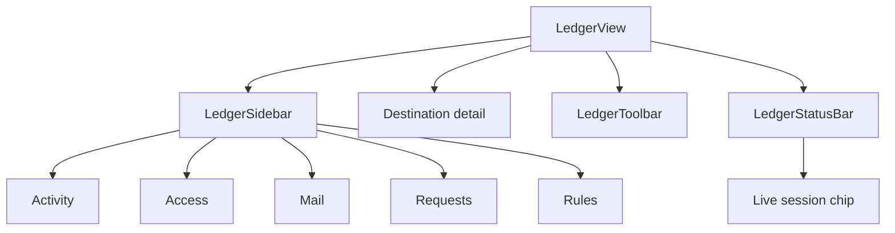
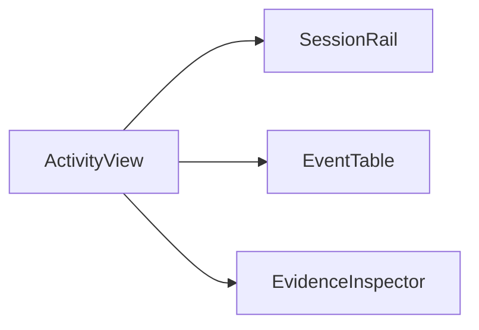
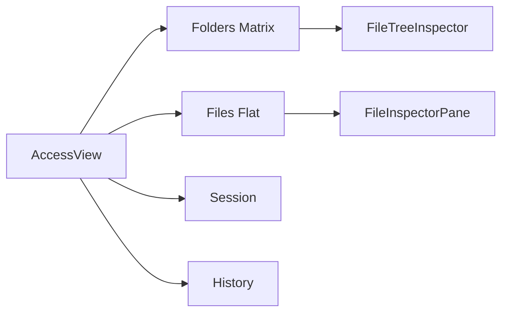
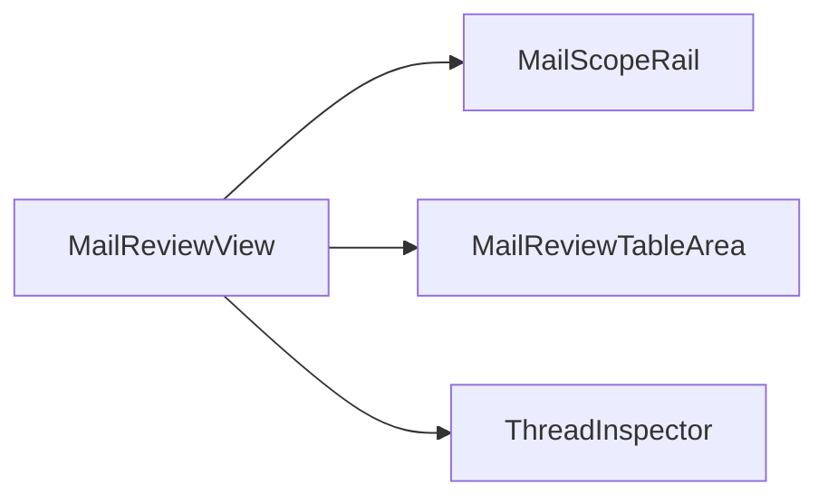
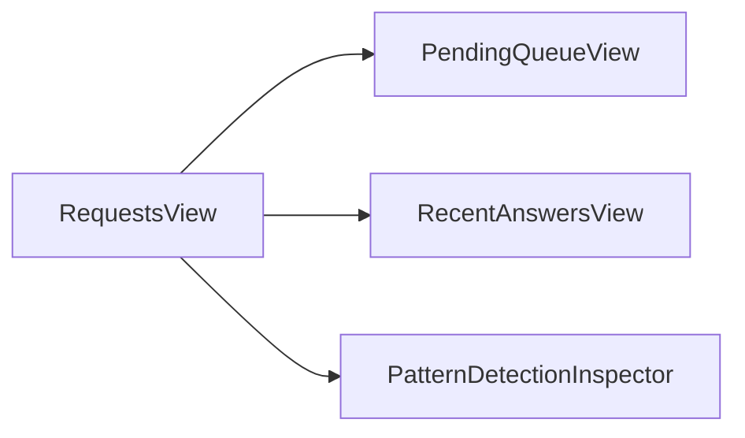

# UI Map

Manifold is the user-owned control plane that sits beside Claude and Codex, recording what they actually saw and changed on your Mac when their work routes through Manifold.

This page maps the current SwiftUI app so contributors can understand the window shell, first-run flow, and supporting surfaces without reverse-engineering the whole view tree.

## The App At A Glance

## The Core User Flow

## First-Run Primer

The first-run experience is intentionally short and skippable. It explains what Manifold is, reminds the user that nothing is shared by default, and offers one quick path to add the first governed folder.

Relevant code:

- [../ManifoldApp/ManifoldApp/Views/FirstRun/FirstRunFlow.swift](../ManifoldApp/ManifoldApp/Views/FirstRun/FirstRunFlow.swift)
- [../ManifoldApp/ManifoldApp/Views/FirstRun/FirstRunPanels.swift](../ManifoldApp/ManifoldApp/Views/FirstRun/FirstRunPanels.swift)
- [../ManifoldApp/ManifoldApp/Views/RootWindowContent.swift](../ManifoldApp/ManifoldApp/Views/RootWindowContent.swift)

## Ledger Window Structure

The main window is a single `NavigationSplitView` with a native macOS sidebar, destination-specific content, a thin toolbar, and an always-visible status bar.

The live session chip lives only in the status bar (one ambient home for runtime state).

### Sidebar destinations

| Destination | Question it answers | Primary file |
|---|---|---|
| Activity | What happened across sessions and events? | [../ManifoldApp/ManifoldApp/Views/Activity/ActivityWindowView.swift](../ManifoldApp/ManifoldApp/Views/Activity/ActivityWindowView.swift) |
| Access | What files are shared right now, and to whom? | [../ManifoldApp/ManifoldApp/Views/Access/AccessWindowView.swift](../ManifoldApp/ManifoldApp/Views/Access/AccessWindowView.swift) |
| Mail | What mailboxes and threads are governed? | [../ManifoldApp/ManifoldApp/Views/Mail/MailWindowView.swift](../ManifoldApp/ManifoldApp/Views/Mail/MailWindowView.swift) |
| Requests | What approvals are waiting on the user, especially standing-write prompts? | [../ManifoldApp/ManifoldApp/Views/Requests/RequestsWindowView.swift](../ManifoldApp/ManifoldApp/Views/Requests/RequestsWindowView.swift) |
| Rules | Which files, emails, and agent behaviors are allowed, denied, warned, or redacted right now? | [../ManifoldApp/ManifoldApp/Views/Rules/RulesView.swift](../ManifoldApp/ManifoldApp/Views/Rules/RulesView.swift) |

## Destination Details

### Activity

This is the main evidence ledger: sessions on the left, event rows in the center, supporting evidence on the right.

### Access

`Access` is the "who can see what" surface. Each row carries an `AccessChipStack` with one chip per connected AI (filled when shared, hollow when hidden, agent-tinted on tap). The Folders matrix has a labelled **Sharing** column that reads `Not shared` / `Shared with X` / `Partly shared · N of M` / `Shared with all`; a small dot beside the pill flags sources with explicit per-file overrides. Source health (`Removed`, `Offline`) renders inline beside the folder name.

Drag-and-drop is wired through the shared `View.manifoldFileDropTarget(store:)` modifier (see `Components/Primitives/FileDropTarget.swift`): folders dispatch to `store.addSourceFromURL` immediately; files raise a confirmation dialog with **Add the whole folder** or **Add only this file** (the latter writes per-file deny overrides for siblings via `setManyFileVisibilityOverrides`).

The file inspector preview opens in the default app on double-click. The folder-tree inspector header stacks title above chips on the narrow inspector pane and drops the per-agent picker when only one AI is connected.

### Mail

`Mail` is intentionally not a full mail client — it's a Synology-Active-Backup-style read-only archive. The thread table prioritises Subject (the highest-information column) over Sender; the Share column renders the same `AccessChipStack` Files uses. The inspector is hidden by default, opens on double-click (or ⌥⌘0), and shows a real scrollable message body (extracted plaintext, fall back to preview) plus an **Open in Mail** button that hands the original `.eml` to `NSWorkspace.shared.open`.

`MailReviewModel` tracks per-agent shared sets (`sharedEmailIDsByAgent`); the view pushes the live `connectedAgents` list in via `setConnectedAgents` so chips track which AIs are activated.

### Requests

Requests are handled in their own destination rather than a blocking modal flow. The current queue is used for standing write approvals, with `Not this time`, `Once`, and `Add to default` as the real answers.

### Rules

`Rules` is the live governance surface. The same `RuleRecord` grammar covers files, emails, and agent behavior; all evaluation runs through `RuleEngine.evaluate` on the runtime. Seeded denies for secrets, SSH keys, 2FA mail, and the like ship on by default and pin to the top of the list. Editing a rule updates real decisions the next time an agent asks, and the inspector shows a live match preview ("would block 7 files, 3 emails right now") plus shadowing warnings when a user rule is pre-empted by a seeded one.

## Supporting Windows, Sheets, And Panels

| Surface | Role | Primary file |
|---|---|---|
| Menu bar panel | Ambient status, session strip, pending requests, quick actions | [../ManifoldApp/ManifoldApp/Views/MenuBar/MenuBarPanelView.swift](../ManifoldApp/ManifoldApp/Views/MenuBar/MenuBarPanelView.swift) |
| Command palette | Keyboard-first jump point for core commands | [../ManifoldApp/ManifoldApp/Views/CommandPaletteView.swift](../ManifoldApp/ManifoldApp/Views/CommandPaletteView.swift) |
| Session start sheet | Starts a session from the main window | [../ManifoldApp/ManifoldApp/Views/Session/SessionStartSheet.swift](../ManifoldApp/ManifoldApp/Views/Session/SessionStartSheet.swift) |
| Reload drift sheet | Rehydrate a prior session context into a new session draft | [../ManifoldApp/ManifoldApp/Views/Session/SessionStartSheet.swift](../ManifoldApp/ManifoldApp/Views/Session/SessionStartSheet.swift) |
| Settings window | General, Agents, Storage, Mail, Rules, and Advanced panes. Rules pane holds global defaults only (per-agent default policy, reset seeded rules) — authoring happens in Ledger ▸ Rules. | [../ManifoldApp/ManifoldApp/Views/Settings/SettingsView.swift](../ManifoldApp/ManifoldApp/Views/Settings/SettingsView.swift) |

## Screen Inventory

### App shell

| File | Role |
|---|---|
| [../ManifoldApp/ManifoldApp/ManifoldApp.swift](../ManifoldApp/ManifoldApp/ManifoldApp.swift) | App entry point, commands, main window, menu bar extra, and settings scene |
| [../ManifoldApp/ManifoldApp/Views/RootWindowContent.swift](../ManifoldApp/ManifoldApp/Views/RootWindowContent.swift) | Switches between the first-run flow and the ledger window, and hosts global sheets |
| [../ManifoldApp/ManifoldApp/Views/LedgerWindowView.swift](../ManifoldApp/ManifoldApp/Views/LedgerWindowView.swift) | Main ledger shell |
| [../ManifoldApp/ManifoldApp/Views/Chrome/NavSidebar.swift](../ManifoldApp/ManifoldApp/Views/Chrome/NavSidebar.swift) | Native sidebar navigation with pending-request badge and footer runtime status |
| [../ManifoldApp/ManifoldApp/Views/Chrome/IntegratedToolbar.swift](../ManifoldApp/ManifoldApp/Views/Chrome/IntegratedToolbar.swift) | Window toolbar actions |
| [../ManifoldApp/ManifoldApp/Views/Chrome/StatusBar.swift](../ManifoldApp/ManifoldApp/Views/Chrome/StatusBar.swift) | Honest runtime and session status strip |

### First run

| File | Role |
|---|---|
| [../ManifoldApp/ManifoldApp/Views/FirstRun/FirstRunFlow.swift](../ManifoldApp/ManifoldApp/Views/FirstRun/FirstRunFlow.swift) | Three-panel primer shown before the ledger on a fresh install |
| [../ManifoldApp/ManifoldApp/Views/FirstRun/FirstRunPanels.swift](../ManifoldApp/ManifoldApp/Views/FirstRun/FirstRunPanels.swift) | Concept, defaults, and guided-add panels |

### Ledger destinations

| File | Role |
|---|---|
| [../ManifoldApp/ManifoldApp/Views/Activity/ActivityWindowView.swift](../ManifoldApp/ManifoldApp/Views/Activity/ActivityWindowView.swift) | Three-pane activity ledger |
| [../ManifoldApp/ManifoldApp/Views/Access/AccessWindowView.swift](../ManifoldApp/ManifoldApp/Views/Access/AccessWindowView.swift) | Shared folders, files, session delta, and activity |
| [../ManifoldApp/ManifoldApp/Views/Mail/MailWindowView.swift](../ManifoldApp/ManifoldApp/Views/Mail/MailWindowView.swift) | Governed mailboxes, threads, session, and activity |
| [../ManifoldApp/ManifoldApp/Views/Requests/RequestsWindowView.swift](../ManifoldApp/ManifoldApp/Views/Requests/RequestsWindowView.swift) | Pending approvals and recent answers |
| [../ManifoldApp/ManifoldApp/Views/Rules/RulesView.swift](../ManifoldApp/ManifoldApp/Views/Rules/RulesView.swift) | Live rules shell (sidebar + table + inspector). Sibling files: `RuleListTable.swift`, `RuleInspector.swift`, `RuleBuilder.swift`, `MatchPreview.swift`. `RulesWindowView.swift` is now an empty shim kept for the Xcode project reference. |

### Support surfaces

| File | Role |
|---|---|
| [../ManifoldApp/ManifoldApp/Views/MenuBar/MenuBarPanelView.swift](../ManifoldApp/ManifoldApp/Views/MenuBar/MenuBarPanelView.swift) | Primary ambient surface outside the ledger window |
| [../ManifoldApp/ManifoldApp/Views/CommandPaletteView.swift](../ManifoldApp/ManifoldApp/Views/CommandPaletteView.swift) | Global command search |
| [../ManifoldApp/ManifoldApp/Views/Session/SessionStartSheet.swift](../ManifoldApp/ManifoldApp/Views/Session/SessionStartSheet.swift) | Session creation and reload flows |
| [../ManifoldApp/ManifoldApp/Views/Settings/SettingsView.swift](../ManifoldApp/ManifoldApp/Views/Settings/SettingsView.swift) | Settings tabs |

## If You Only Want The 80/20

Start with these files:

1. [../ManifoldApp/ManifoldApp/ManifoldApp.swift](../ManifoldApp/ManifoldApp/ManifoldApp.swift)
2. [../ManifoldApp/ManifoldApp/Views/RootWindowContent.swift](../ManifoldApp/ManifoldApp/Views/RootWindowContent.swift)
3. [../ManifoldApp/ManifoldApp/Views/LedgerWindowView.swift](../ManifoldApp/ManifoldApp/Views/LedgerWindowView.swift)
4. [../ManifoldApp/ManifoldApp/Views/Chrome/NavSidebar.swift](../ManifoldApp/ManifoldApp/Views/Chrome/NavSidebar.swift)
5. [../ManifoldApp/ManifoldApp/Views/FirstRun/FirstRunFlow.swift](../ManifoldApp/ManifoldApp/Views/FirstRun/FirstRunFlow.swift)
6. [../ManifoldApp/ManifoldApp/Views/Activity/ActivityWindowView.swift](../ManifoldApp/ManifoldApp/Views/Activity/ActivityWindowView.swift)
