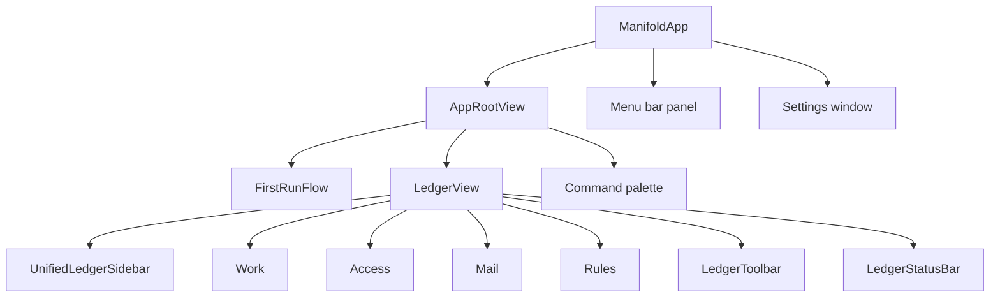
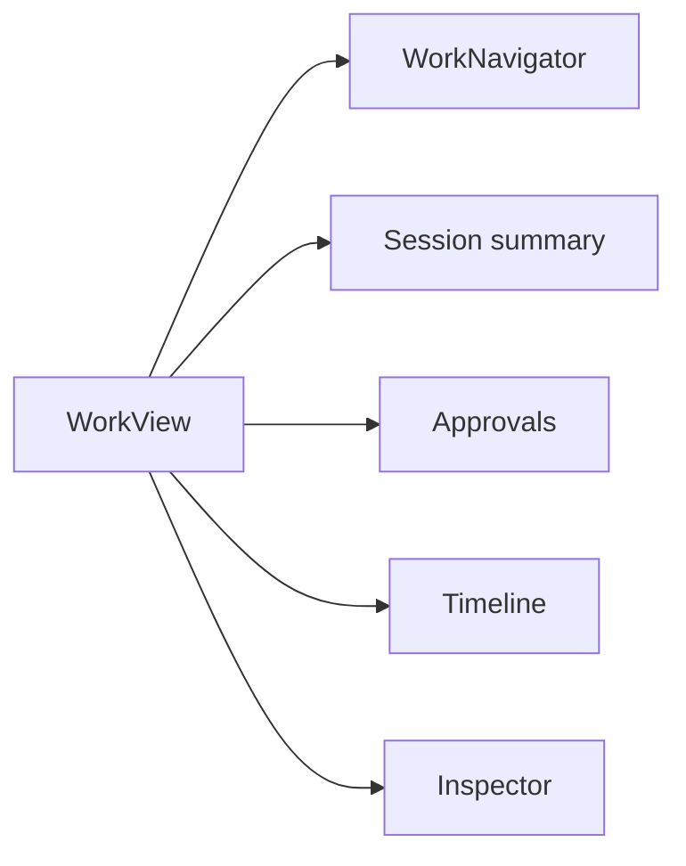
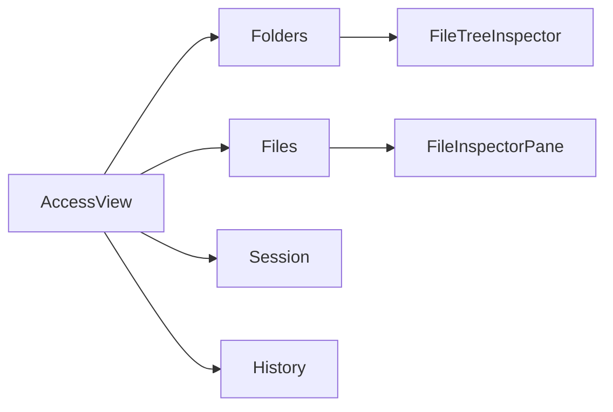
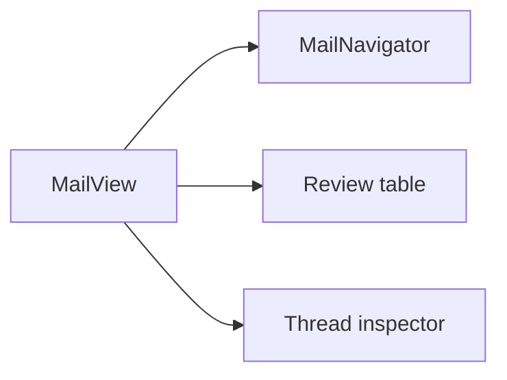
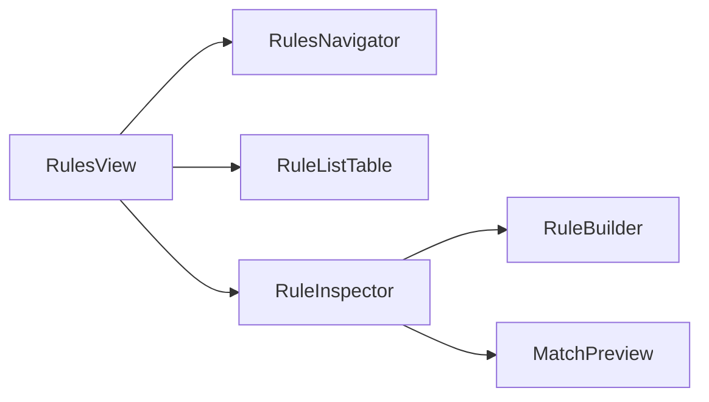

# UI Map

Manifold is the user-owned control plane beside Claude and Codex. The app records what agents can see, what they actually read, and what they changed when work routes through Manifold.

## App At A Glance

The main window has exactly four user-facing spaces:

| Space | Purpose | Primary file |
|---|---|---|
| Work | Sessions, approvals, activity timeline, runtime health, and write review | `Views/Work/WorkView.swift` |
| Access | Folder/file sharing, per-agent overrides, session diff, and source history | `Views/Access/AccessWindowView.swift` |
| Mail | Governed mail review, per-agent email sharing, and thread inspection | `Views/Mail/MailWindowView.swift` |
| Rules | File, email, privacy, and agent-behavior guardrails | `Views/Rules/RulesView.swift` |

Older top-level route names are not valid app destinations. Session history, approval handling, runtime health, and activity evidence now live inside **Work**.

## First Run

`FirstRunFlow` is short and skippable. It explains the product, confirms that nothing is shared by default, optionally adds a first folder, then opens the Work surface.

Relevant files:

- `Views/FirstRun/FirstRunFlow.swift`
- `Views/FirstRun/FirstRunPanels.swift`
- `Views/RootWindowContent.swift`

## Work

Work is the operational surface. It shows the current session, prepared/recent sessions, privacy and write approvals, filtered timeline events, write restore details, and runtime issues. The inspector follows the selected session, approval, activity event, write event, or runtime issue.

## Access

Access owns the "who can see what" model for files and folders. It includes per-agent sharing, explicit file/folder overrides, source health, file preview, exposure audit, versions, restore, and session reload history.

## Mail

Mail is a governed review surface, not a mail client. It shows accounts, mailboxes, quick filters, searchable message rows, per-agent share/hide controls, message metadata, body preview, attachments, and Mail.app handoff.

## Rules

Rules is the live governance surface. Suggested rules ship on by default, and user-created rules use the same grammar across files, emails, privacy filters, and agent behavior. Rule changes affect the next runtime decision.

## Supporting Surfaces

| Surface | Role |
|---|---|
| Menu bar panel | Ambient status, current session, approvals, recent sessions, and quick actions |
| Command palette | Keyboard-first command search |
| Settings | General, Agents, Storage, Mail, Rules defaults, Privacy, Sessions, and Advanced |
| Synthetic loop | Deterministic MCP/UI self-improvement harness via `scripts/run_self_improvement_loop.sh` |

## Testing Map

- Package baseline: `swift test`
- Fixture UI: `bash scripts/run_ui_tests.sh --suite fixture`
- Synthetic UI: `bash scripts/run_ui_tests.sh --suite synthetic`
- Full synthetic loop: `bash scripts/run_self_improvement_loop.sh`
