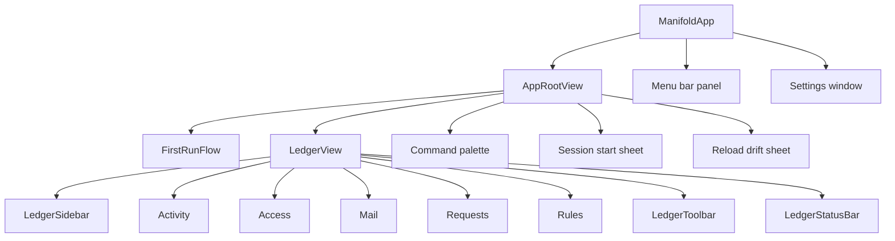
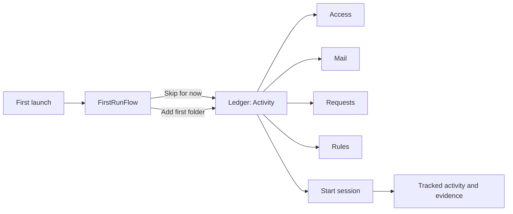
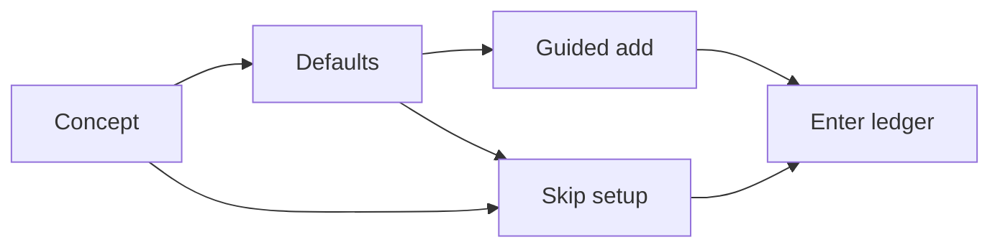
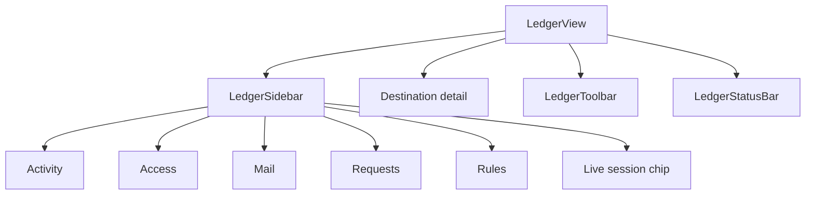
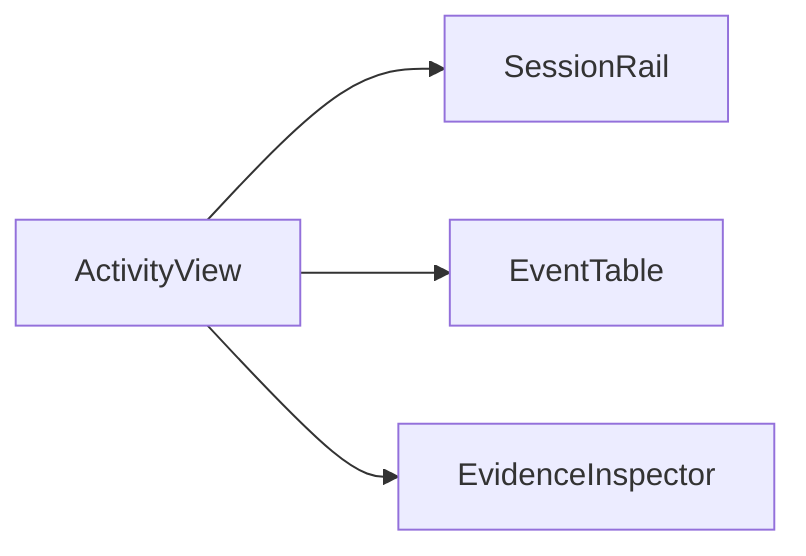
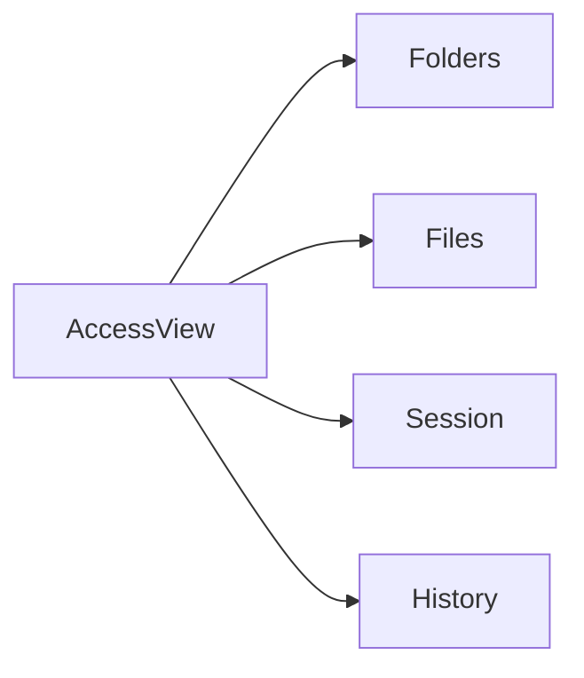
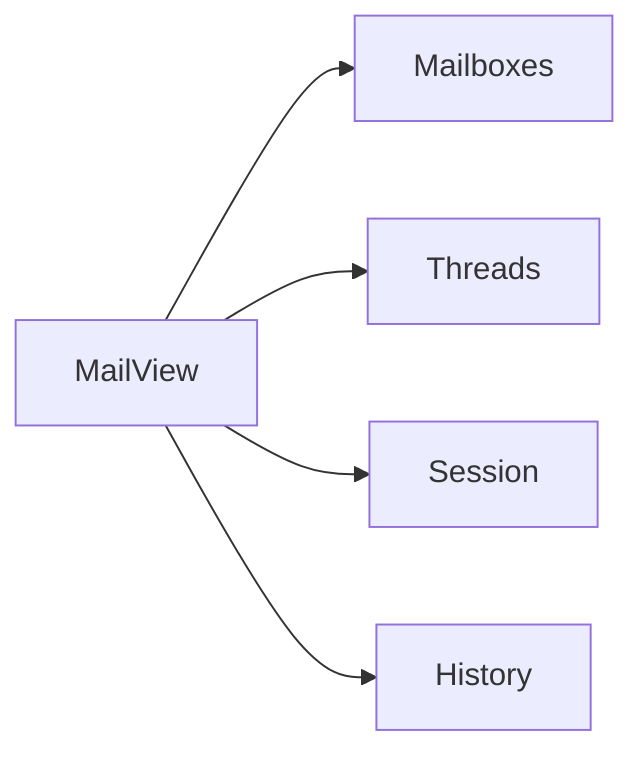
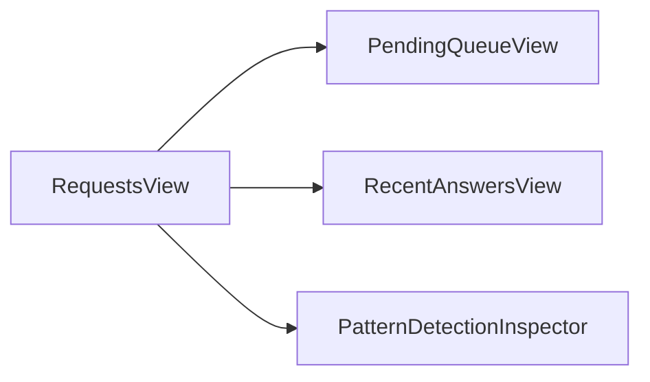
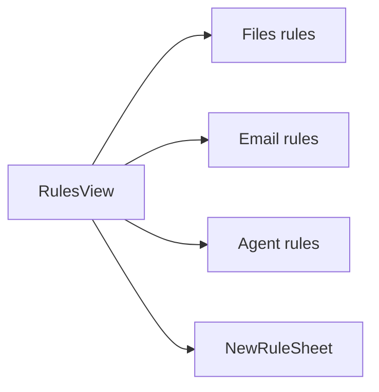

# UI Map

Manifold is the user-owned control plane that sits beside Claude and Codex, recording what they actually saw and changed on your Mac when their work routes through Manifold.

This page maps the current SwiftUI app so contributors can understand the window shell, first-run flow, and supporting surfaces without reverse-engineering the whole view tree.

## The App At A Glance

## The Core User Flow

## First-Run Primer

The first-run experience is intentionally short and skippable. It explains what Manifold is, reminds the user that nothing is shared by default, and offers one quick path to add the first governed folder.

Relevant code:

- [../ManifoldApp/ManifoldApp/Views/FirstRun/FirstRunFlow.swift](../ManifoldApp/ManifoldApp/Views/FirstRun/FirstRunFlow.swift)
- [../ManifoldApp/ManifoldApp/Views/FirstRun/FirstRunPanels.swift](../ManifoldApp/ManifoldApp/Views/FirstRun/FirstRunPanels.swift)
- [../ManifoldApp/ManifoldApp/Views/RootWindowContent.swift](../ManifoldApp/ManifoldApp/Views/RootWindowContent.swift)

## Ledger Window Structure

The main window is a single `NavigationSplitView` with a native macOS sidebar, destination-specific content, a thin toolbar, and an always-visible status bar.

### Sidebar destinations

| Destination | Question it answers | Primary file |
|---|---|---|
| Activity | What happened across sessions and events? | [../ManifoldApp/ManifoldApp/Views/Activity/ActivityWindowView.swift](../ManifoldApp/ManifoldApp/Views/Activity/ActivityWindowView.swift) |
| Access | What files are shared right now, and to whom? | [../ManifoldApp/ManifoldApp/Views/Access/AccessWindowView.swift](../ManifoldApp/ManifoldApp/Views/Access/AccessWindowView.swift) |
| Mail | What mailboxes and threads are governed? | [../ManifoldApp/ManifoldApp/Views/Mail/MailWindowView.swift](../ManifoldApp/ManifoldApp/Views/Mail/MailWindowView.swift) |
| Requests | What approvals are waiting on the user, especially standing-write prompts? | [../ManifoldApp/ManifoldApp/Views/Requests/RequestsWindowView.swift](../ManifoldApp/ManifoldApp/Views/Requests/RequestsWindowView.swift) |
| Rules | What shape will future global governance authoring take? | [../ManifoldApp/ManifoldApp/Views/Rules/RulesWindowView.swift](../ManifoldApp/ManifoldApp/Views/Rules/RulesWindowView.swift) |

## Destination Details

### Activity

This is the main evidence ledger: sessions on the left, event rows in the center, supporting evidence on the right.

### Access

`Access` is the "who can see what" surface. It falls back to an empty state when the user has not shared any folders yet.

### Mail

`Mail` is intentionally not a full mail client. It focuses on governed mailboxes, threads, and session evidence.

### Requests

Requests are handled in their own destination rather than a blocking modal flow. The current queue is used for standing write approvals, with `Not this time`, `Once`, and `Add to default` as the real answers.

### Rules

`Rules` is currently a preview surface. It shows the intended grammar for future file, email, and agent governance authoring, but changes remain local preview state today.

## Supporting Windows, Sheets, And Panels

| Surface | Role | Primary file |
|---|---|---|
| Menu bar panel | Ambient status, session strip, pending requests, quick actions | [../ManifoldApp/ManifoldApp/Views/MenuBar/MenuBarPanelView.swift](../ManifoldApp/ManifoldApp/Views/MenuBar/MenuBarPanelView.swift) |
| Command palette | Keyboard-first jump point for core commands | [../ManifoldApp/ManifoldApp/Views/CommandPaletteView.swift](../ManifoldApp/ManifoldApp/Views/CommandPaletteView.swift) |
| Session start sheet | Starts a session from the main window | [../ManifoldApp/ManifoldApp/Views/Session/SessionStartSheet.swift](../ManifoldApp/ManifoldApp/Views/Session/SessionStartSheet.swift) |
| Reload drift sheet | Rehydrate a prior session context into a new session draft | [../ManifoldApp/ManifoldApp/Views/Session/SessionStartSheet.swift](../ManifoldApp/ManifoldApp/Views/Session/SessionStartSheet.swift) |
| Settings window | General, Agents, Storage, Mail, and Advanced panes | [../ManifoldApp/ManifoldApp/Views/Settings/SettingsView.swift](../ManifoldApp/ManifoldApp/Views/Settings/SettingsView.swift) |

## Screen Inventory

### App shell

| File | Role |
|---|---|
| [../ManifoldApp/ManifoldApp/ManifoldApp.swift](../ManifoldApp/ManifoldApp/ManifoldApp.swift) | App entry point, commands, main window, menu bar extra, and settings scene |
| [../ManifoldApp/ManifoldApp/Views/RootWindowContent.swift](../ManifoldApp/ManifoldApp/Views/RootWindowContent.swift) | Switches between the first-run flow and the ledger window, and hosts global sheets |
| [../ManifoldApp/ManifoldApp/Views/LedgerWindowView.swift](../ManifoldApp/ManifoldApp/Views/LedgerWindowView.swift) | Main ledger shell |
| [../ManifoldApp/ManifoldApp/Views/Chrome/NavSidebar.swift](../ManifoldApp/ManifoldApp/Views/Chrome/NavSidebar.swift) | Native sidebar navigation and live session chip |
| [../ManifoldApp/ManifoldApp/Views/Chrome/IntegratedToolbar.swift](../ManifoldApp/ManifoldApp/Views/Chrome/IntegratedToolbar.swift) | Window toolbar actions |
| [../ManifoldApp/ManifoldApp/Views/Chrome/StatusBar.swift](../ManifoldApp/ManifoldApp/Views/Chrome/StatusBar.swift) | Honest runtime and session status strip |

### First run

| File | Role |
|---|---|
| [../ManifoldApp/ManifoldApp/Views/FirstRun/FirstRunFlow.swift](../ManifoldApp/ManifoldApp/Views/FirstRun/FirstRunFlow.swift) | Three-panel primer shown before the ledger on a fresh install |
| [../ManifoldApp/ManifoldApp/Views/FirstRun/FirstRunPanels.swift](../ManifoldApp/ManifoldApp/Views/FirstRun/FirstRunPanels.swift) | Concept, defaults, and guided-add panels |

### Ledger destinations

| File | Role |
|---|---|
| [../ManifoldApp/ManifoldApp/Views/Activity/ActivityWindowView.swift](../ManifoldApp/ManifoldApp/Views/Activity/ActivityWindowView.swift) | Three-pane activity ledger |
| [../ManifoldApp/ManifoldApp/Views/Access/AccessWindowView.swift](../ManifoldApp/ManifoldApp/Views/Access/AccessWindowView.swift) | Shared folders, files, session delta, and activity |
| [../ManifoldApp/ManifoldApp/Views/Mail/MailWindowView.swift](../ManifoldApp/ManifoldApp/Views/Mail/MailWindowView.swift) | Governed mailboxes, threads, session, and activity |
| [../ManifoldApp/ManifoldApp/Views/Requests/RequestsWindowView.swift](../ManifoldApp/ManifoldApp/Views/Requests/RequestsWindowView.swift) | Pending approvals and recent answers |
| [../ManifoldApp/ManifoldApp/Views/Rules/RulesWindowView.swift](../ManifoldApp/ManifoldApp/Views/Rules/RulesWindowView.swift) | Files, email, and agent governance rules |

### Support surfaces

| File | Role |
|---|---|
| [../ManifoldApp/ManifoldApp/Views/MenuBar/MenuBarPanelView.swift](../ManifoldApp/ManifoldApp/Views/MenuBar/MenuBarPanelView.swift) | Primary ambient surface outside the ledger window |
| [../ManifoldApp/ManifoldApp/Views/CommandPaletteView.swift](../ManifoldApp/ManifoldApp/Views/CommandPaletteView.swift) | Global command search |
| [../ManifoldApp/ManifoldApp/Views/Session/SessionStartSheet.swift](../ManifoldApp/ManifoldApp/Views/Session/SessionStartSheet.swift) | Session creation and reload flows |
| [../ManifoldApp/ManifoldApp/Views/Settings/SettingsView.swift](../ManifoldApp/ManifoldApp/Views/Settings/SettingsView.swift) | Settings tabs |

## If You Only Want The 80/20

Start with these files:

1. [../ManifoldApp/ManifoldApp/ManifoldApp.swift](../ManifoldApp/ManifoldApp/ManifoldApp.swift)
2. [../ManifoldApp/ManifoldApp/Views/RootWindowContent.swift](../ManifoldApp/ManifoldApp/Views/RootWindowContent.swift)
3. [../ManifoldApp/ManifoldApp/Views/LedgerWindowView.swift](../ManifoldApp/ManifoldApp/Views/LedgerWindowView.swift)
4. [../ManifoldApp/ManifoldApp/Views/Chrome/NavSidebar.swift](../ManifoldApp/ManifoldApp/Views/Chrome/NavSidebar.swift)
5. [../ManifoldApp/ManifoldApp/Views/FirstRun/FirstRunFlow.swift](../ManifoldApp/ManifoldApp/Views/FirstRun/FirstRunFlow.swift)
6. [../ManifoldApp/ManifoldApp/Views/Activity/ActivityWindowView.swift](../ManifoldApp/ManifoldApp/Views/Activity/ActivityWindowView.swift)
